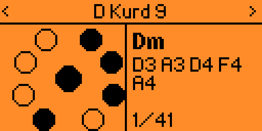
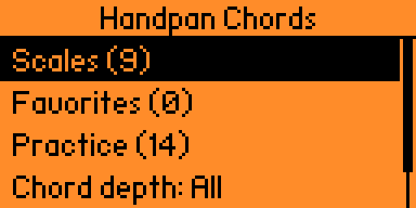
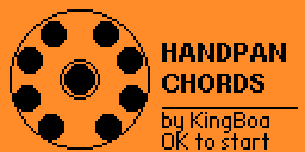

# Handpan Chords

A chord reference and practice tool for handpans on the Flipper Zero. Pick a
drum, scroll the chords it can actually play, and see which pads to strike on a
diagram of the shell. Practice mode plays melodic phrases back one pad at a
time so you can follow along. Favorites persist to the SD card.

Both the chords and the practice phrases are **derived at runtime** from each
drum's tuning — nothing is hardcoded per drum. See
[How chord derivation works](#how-chord-derivation-works) and
[How practice patterns work](#how-practice-patterns-work).

By KingBoa — [NoodleNugget.com](https://noodlenugget.com)

| | | |
| --- | --- | --- |
|  |  |  |

## Building (macOS)

macOS 14+ blocks `pip3 install` into the system Python, so install ufbt through
pipx:

```bash
brew install pipx && pipx ensurepath && pipx install ufbt
```

The app ships a FAP icon, and ufbt's icon pipeline needs two extra Python
packages that don't come with it. Inject them into ufbt's virtualenv:

```bash
pipx inject ufbt Pillow heatshrink2
```

Without these the build fails when converting `icon.png` — Pillow is the image
reader and heatshrink2 is the compressor. (ufbt falls back to the ImageMagick
`convert` and `heatshrink` CLIs if the modules are absent, but neither ships
with macOS.)

Restart your shell (or `export PATH="$HOME/.local/bin:$PATH"`), then pull the
SDK and build:

```bash
ufbt update     # downloads the firmware SDK + ARM toolchain, once
ufbt            # builds dist/handpan_chords.fap
```

Copy `dist/handpan_chords.fap` to your Flipper under `apps/Music/` — via
qFlipper, the SD card, or `ufbt launch` to deploy and start it in one step.
Quit qFlipper first if it's running; it holds the serial port.

The app targets the stock SDK but uses only plain `ViewPort` +
`FuriMessageQueue`, with no `ViewDispatcher`, `Submenu`, or other gui module
whose API drifts between forks, so it builds unmodified on stock, Momentum, and
Unleashed.

## Screens

**Launch** — an animated splash: the shell fills in one pad at a time, low to
high (about 1.8s, a slow arpeggio rather than a flicker), then a wave breathes
outward from the ding on a loop. It does **not** advance on its own — it waits
for a keypress, so the prompt means what it says. Any key opens the menu.

**Chord view** — the pan diagram with the chord's pads filled, its note names,
and a star if it's a favorite.

**Practice** — a phrase played back one pad at a time, Simon-says style: the
current pad is filled, the next one is marked with a dot so you can see where
the line is heading, and a progress strip shows how far through you are.

Press OK to let it run; `>` in the corner means playing, `||` means stopped,
next to the current speed. Up/Down picks the speed — **Slow**, **Med** or
**Fast** (40 / 60 / 80 BPM), and changing it mid-phrase takes effect on the
very next step. Left/Right steps back or forward a single note **and stops
playback**, so you can walk the phrase at your own pace; OK picks it up again
from wherever you left off.

## Controls

| Screen | Key | Action |
| --- | --- | --- |
| Main menu | Up / Down | Move cursor |
| | Left / Right | Cycle chord depth (on "Chord depth") |
| | OK | Open item; cycles depth on "Chord depth" |
| | Back | Exit the app |
| Scale list | Up / Down | Move cursor |
| | OK | Open the chord view for that drum |
| | Back | Main menu |
| Chord view | Up / Down | Previous / next chord (wraps) |
| | Left / Right | Previous / next drum (resets to chord 1) |
| | OK | Add or remove this chord from favorites |
| | Back | Return to wherever you came from |
| Favorites | Up / Down | Move cursor |
| | OK | Jump to that chord in the chord view |
| | Left | Delete the favorite |
| | Back | Main menu |
| Practice list | Up / Down | Move cursor |
| | Left / Right | Previous / next drum (re-filters the patterns) |
| | OK | Open the phrase |
| | Back | Main menu |
| Play-along | Left / Right | Step back / forward by hand — also pauses playback |
| | Up / Down | Speed: Slow / Med / Fast |
| | OK | Start / stop automatic playback |
| | Back | Practice list |

A **filled pad** on the diagram means strike it; an outline means leave it. The
ding is the large circle at the centre. In practice mode the pad marked with a
**dot** is the one coming next.

**Chord depth** filters how rich the chords get:

| Setting | Max tones | Includes |
| --- | --- | --- |
| Triads | 3 | major, minor, dim, aug, sus2, sus4 |
| +7ths | 4 | plus 6, m6, 7, maj7, m7, m7b5, add9, madd9 |
| All | 5 | plus 9, maj9, m9, m11 |

Opening a favorite whose chord is richer than the current filter widens the
filter to All automatically, so a saved `Fm11` is always reachable.

## How chord derivation works

There is no chord table per drum. Each drum is stored as nothing but MIDI note
numbers, and every chord it can play is computed on the fly in
`hp_build_chords()` (`scales.c`):

```c
size_t hp_build_chords(const HpScale* s, uint8_t max_tones, HpChord* out, size_t max);
```

1. **Collect pitch classes.** Every pad on the drum — the ding included — is
   reduced to a pitch class with `1 << (midi % 12)` and OR'd into a 12-bit mask.
   `D Kurd 9` becomes `{D, E, F, G, A, Bb, C}`.
2. **Walk candidate roots.** Starting at the *ding's* pitch class and stepping up
   chromatically, skipping any root the drum doesn't have. Starting at the ding
   is what makes the tonic chord land first — `Dm` is chord 1 of 41 on D Kurd 9,
   not buried at position 17.
3. **Test every formula.** For each root, each entry in `hp_formulas[]` is
   checked: the chord qualifies only if **all** of its tones are present in the
   pitch-class mask. A `Dm7` needs D, F, A *and* C; if the drum lacks any one of
   them the chord never appears.
4. **Map back to physical pads.** `pad_mask` gets a bit set for every pad whose
   pitch class is in the chord — bit 0 for the ding, bits 1..9 for tone fields
   ascending. Because it maps by *pitch class*, a note that appears on two pads
   (the octave, usually) lights **both**. On D Kurd 9, `Dm` lights the D3 ding,
   A3, D4, F4, and A4 — five pads for a three-note chord.
5. **Name it.** Display name is the root name plus the formula suffix, spelled
   with sharps or flats according to the drum's `flats` flag, so F Low Pygmy
   reads `Ab` rather than `G#`.

Output is capped at `HP_MAX_CHORDS` (72). The richest drum currently produces 41
chords, so nothing is truncated today.

### Formula table ordering

`hp_formulas[]` is ordered simplest-first — triads, then sixths and sevenths,
then extensions — because the depth filter is just `formula->count <= max_tones`.

The index into this table is what gets written to `favorites.txt`. **Appending is
safe; reordering would silently rewrite every saved favorite.**

## How practice patterns work

Same idea as the chords: phrases are stored once, not per drum. A pattern is a
list of strikes, each written as **semitone offsets from the drum's ding pitch
class** — that is, scale degrees:

```
0=1   2=2   3=b3   4=3   5=4   7=5   8=b6   9=6   10=b7   11=7
```

So `HP_N(0), HP_N(2), HP_N(3), HP_N(5), HP_N(7), ...` is "walk up to the fifth
and back" in any minor key. On D Kurd 9 that renders as
`D4 E4 F4 G4 A4 G4 F4 E4 D4`; on B Kurd 9 the identical data gives
`B3 C#4 D4 E4 F#4 E4 D4 C#4 B3`.

A strike carries up to two voices, which is how the ding and two-pad hits are
written:

| Written as | Means | Example on D Kurd 9 |
| --- | --- | --- |
| `HP_N(3)` | one tone field | `F4` |
| `HP_D` | the ding alone | `D3` |
| `HP_DN(0)` | ding struck with a tone field | `D3+D4` |
| `HP_NN(0, 7)` | two tone fields together | `A3+D4` |

`HP_DING` exists because the ding shares the tonic's pitch class. A plain `0`
would let the voicer pick whichever octave sits nearest, and it essentially
never picks the ding — before these were added, the ding accounted for 2 strikes
out of 563 across the whole library, both incidental. Say `HP_D` when you mean
the bass voice.

**Availability.** `hp_pattern_available()` offers a pattern only when the drum
has every degree it uses. That filtering is what keeps the minor phrases off
C Major 9 and the major ones off the Kurds, with no per-drum tagging:

| Drum | Scale it yields | Patterns |
| --- | --- | --- |
| D Kurd 9, E La Sirena 9, B Kurd 9, A Kurd 9 | full natural minor | 14 |
| D Celtic Min 9, C# Amara 9 | minor, no b6 | 11 |
| F Low Pygmy 9 | minor pentatonic | 9 |
| D Sabye 9, C Major 9 | major | 7 |

The plain single-note phrases come first in the list, then the ones using the
ding and two-pad strikes — `Ding Groove`, `Bass & Melody`, `Octave Roll`,
`Open Fifths`, `Drone Cycle`, `Bass Walk`, `Ding & Thirds` — so the list reads
simplest-first.

**Voicing.** `hp_pattern_steps()` turns pitch classes into specific pads. This is
less trivial than it sounds: a note usually exists on two pads an octave apart,
and picking the nearest one at each step — the obvious greedy approach — quietly
wrecks the phrase. A descending line walks into the bottom of the drum and then
has to leap an octave back up to carry on. On D Kurd 9 the greedy version turned
a descent into `C4 Bb3 A3 G4 F4 E4 D4`: a 10-semitone jump upward in the middle
of a phrase that is supposed to be going down.

So the whole phrase is voiced at once, as a small shortest-path over
`(step, pad)` that minimises the total distance the hands travel. The same
descent now comes out as `A4 G4 F4 E4 D4 C4 Bb3 A3` — a clean octave, largest
interval a whole tone.

**The ding sits outside that path.** It's the bass voice, not part of the tune,
so the shortest path runs over the tone-field steps only and `HP_D` steps pass
through. Include them and a phrase alternating bass and melody drags the melody
down into the ding's octave: `Ding Groove` came out as
`D3 F4 D3 G4 D3 A3 G4 F4`, where the rising `b3 4 5` collapses because A3 sits
nearer the ding than A4 does. Skipping the ding for contour purposes gives
`D3 F4 D3 G4 D3 A4 G4 F4`.

For the same reason a plain pitch-class voice is charged a heavy penalty for
landing on the ding, so it's only used when no tone field carries the note at
all. Without it, `HP_D, HP_N(0)` voiced as `D3 D3` — two identical strikes in a
row, which reads on screen as nothing having happened.

The second voice of a two-pad strike is placed after the melody is settled, on
whichever pad carrying its note is closest to the one already committed to —
close pads being the ones you can realistically strike together.

Across all nine drums and every pattern: 101 phrases, 851 strikes, no adjacent
duplicate strikes, and the widest melodic interval anywhere is 9 semitones —
which only occurs inside `Minor Cycle`, where it's a chord change and musically
intended.

**A drum's tone fields span only about one octave**, which is why the patterns
are written to stay inside a single register, and why anything that descends
starts high enough to have somewhere to go.

## Adding a new drum

Say you want to add a `G Hijaz 9`: ding G3, tone fields Ab3 B3 C4 D4 Eb4 F4 G4 Ab4.

Middle C is MIDI 60, so C4 = 60, and each semitone is 1. That puts G3 at 55
(five semitones below C4), D3 at 50, and A2 at 45. Octave numbering is
`(midi / 12) - 1`.

**1. Add the pad array** in `scales.c`, alongside the others — tone fields
ascending, ding kept separate. Comment it with the note names so the data stays
auditable:

```c
static const uint8_t hp_g_hijaz9[] = {56, 59, 60, 62, 63, 65, 67, 68};
/* G3 | Ab3 B3 C4 D4 Eb4 F4 G4 Ab4 */
```

**2. Add the scale-table row** to `hp_scales[]`:

```c
{"G Hijaz 9", 55, hp_g_hijaz9, COUNT_OF(hp_g_hijaz9), true},
/*  name       ding  tones      tone_count            flats */
```

The last field selects accidental spelling: `true` spells flats (Ab, Bb, Eb),
`false` spells sharps (G#, A#, D#). Hijaz reads naturally in flats, so `true`.

That's it — no chord list, no pad mapping, no display names, and no pattern
list either. Rebuild with `ufbt` and the drum appears with its full chord set
derived and every compatible practice phrase already voiced for it.
`hp_scale_count` updates itself via `COUNT_OF`.

Two things to keep in mind:

- The diagram supports up to **9 tone fields** (`HP_MAX_TONE_FIELDS`). Every drum
  shipped here has 8; a 9th is already positioned at the top of the shell.
- Appending to `hp_scales[]` is safe for existing favorites, since favorites store
  a scale index. Inserting a drum in the *middle* would repoint saved favorites at
  the wrong drum.

## Adding a practice pattern

Add the offsets and a row in `hp_patterns[]`; availability filtering and voicing
are automatic:

```c
static const HpStep hp_pat_my_phrase[] = {
    HP_D,            /* the ding                       */
    HP_N(3),         /* b3                             */
    HP_NN(0, 7),     /* root and fifth struck together */
    HP_N(5),
    HP_N(3),
    HP_DN(0),        /* ding plus the tonic field      */
};

/* ...then in hp_patterns[]: */
{"My Phrase", HP_PAT(hp_pat_my_phrase)},
```

Keep phrases to `HP_MAX_STEPS` (16) steps or fewer, and prefer motion by step or
small skip — a phrase that keeps climbing past an octave will be voiced with a
jump back down, because the drum runs out of pads.

## Files

| File | Contents |
| --- | --- |
| `application.fam` | App manifest — entry point, category, stack size, permissions |
| `handpan.h` | Types, extern tables, function declarations |
| `scales.c` | Drum data, chord formulas, note naming, chord derivation, practice patterns |
| `favorites.c` | SD card persistence |
| `handpan.c` | Screens, drawing, input, entry point |
| `icon.png` | 10×10 1-bit FAP icon (a handpan seen from above) |

## Persistence

Favorites live at `/ext/apps_data/handpan/favorites.txt`, capped at 64. The
directory is created on first write. Format is a comment header plus one
`scale,root_pc,formula` line per favorite:

```
# Handpan Chords favorites
# scale,root_pc,formula
0,2,10
8,5,17
```

Parsing uses `strtol` and validates every field against the current table bounds;
malformed lines are skipped rather than trusted, so a hand-edited or truncated
file can't crash the app. Favorites load at startup and are written immediately on
every add or delete.

Practice speed is not persisted; it resets to Fast each launch.
