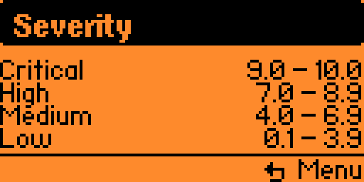

# Pocket CVSS

[](https://flipperzero.one/)
[](https://www.first.org/cvss/v3.1/specification-document)
[](https://github.com/vavkamil/pocket-cvss/actions/workflows/ci.yml)
[](https://github.com/vavkamil/pocket-cvss/stargazers)

Pocket CVSS is a native Flipper Zero app for learning and calculating CVSS v3.1 Base
scores offline.

It provides a compact metric wizard, calculates the Base score, and shows the resulting
severity and vector in a Flipper-friendly layout.

<p>
  
  
  
  
</p>

## Features

- CVSS v3.1 Base metric wizard for offline scoring
- Automatic score, severity, and canonical vector formatting
- Built-in educational examples for common vulnerability classes
- Severity range reference for quick learning
- Compact Flipper-friendly result, vector, and navigation screens

## Build

```bash
ufbt
```

## Run On Flipper

```bash
ufbt launch
```

## Test

Host-side tests cover the CVSS scoring engine, real CVE vectors, and the educational
examples used by the app:

```bash
cc -std=c11 -Wall -Wextra -I. tests/cvss31_test.c cvss31.c -o /tmp/pocket_cvss_tests
/tmp/pocket_cvss_tests
```

## Development

```bash
ufbt format
ufbt lint
```
