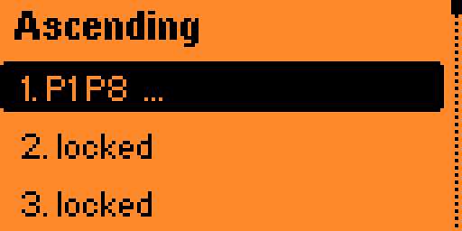
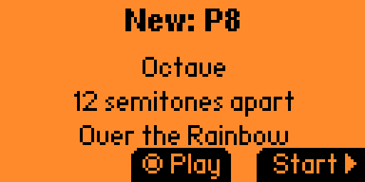
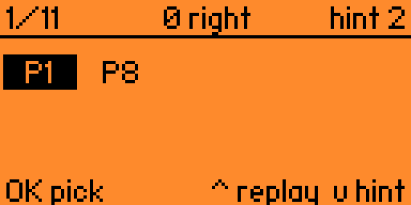
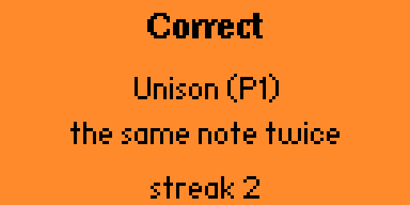
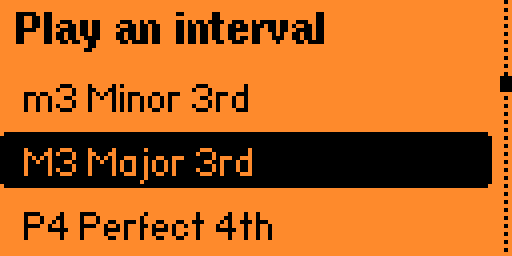
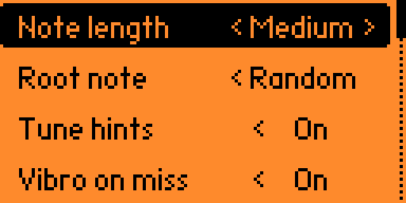

# Ear Trainer

Learn to recognise musical intervals by ear, on your Flipper Zero.

I kept trying to pick out melodies and kept guessing at the jumps between
notes. This is the drill I wanted: it plays you two notes and you name the gap.
You start with the intervals nobody mixes up — an octave and a fifth — and the
close, nasty ones arrive only once the easy ones are automatic.

## Modes

- **Ascending** — the low note first
- **Descending** — the high note first
- **Mixed** — either direction, at random

Each mode keeps its own level progress, because hearing a descending minor 6th
is genuinely a different skill from hearing it ascending.

## Levels

Thirteen levels, widest intervals first:

| | Adds | | Adds |
|---|---|---|---|
| 1 | Unison, Octave | 8 | Major 2nd |
| 2 | Perfect 5th | 9 | Major 6th |
| 3 | Perfect 4th | 10 | Minor 6th |
| 4 | *Mix 1* | 11 | Minor 2nd |
| 5 | Major 3rd | 12 | Minor 7th, Major 7th |
| 6 | Minor 3rd | 13 | Tritone |
| 7 | *Mix 2* | | |

Levels that add something new introduce it first — name, size in semitones, and
a tune that opens with it — and let you play it as often as you like before the
quiz starts. Mix levels add nothing new and instead throw everything learned so
far at you, with three lives.

Clearing a level unlocks the next. Stars are 80% / 90% / perfect.

## Controls

In a quiz:

| Key | Action |
|-----|--------|
| Left / Right | Move through the answers |
| OK | Confirm |
| Up | Replay the notes |
| Down | Spend a hint — strikes out two wrong answers |
| Back | Press twice to leave |

Two hints per quiz. Back needs two presses so a stray thumb doesn't bin a run.

## The tune hints

Every interval is tagged with a song that opens with it, which is the fastest
way to get from "I hear a gap" to "that's a fourth":

| | | | |
|---|---|---|---|
| m2 | Jaws | m6 | The Entertainer |
| M2 | Happy Birthday | M6 | My Bonnie |
| m3 | Greensleeves | m7 | Star Trek theme |
| M3 | When the Saints | M7 | Take On Me |
| P4 | Here Comes the Bride | P8 | Over the Rainbow |
| TT | The Simpsons | | |
| P5 | Star Wars theme | | |

There's also an **Interval reference** screen in the menu that plays any of the
thirteen on demand — handy before a session, or to re-anchor after a bad run.

## Settings

- **Note length** — short / medium / long
- **Root note** — fixed C4, or random each question. Random is the default and
  it matters: a fixed root lets you memorise two pitches instead of learning
  the distance between them, which is the whole point.
- **Tune hints** — show the mnemonic on the answer screen
- **Vibro on miss**, **LED feedback**

Progress and settings live in `apps_data/ear_trainer/` and survive reboots.

## Notes on the build

Tones come out of the piezo on a dedicated worker thread with its own message
queue, so playback never blocks the UI and a replay can cut off whatever is
already sounding. Note frequencies are a fixed-point table from C4 to C6 rather
than `powf` at runtime.

The saved files carry a magic number and a version, and anything unexpected
resets to defaults instead of crashing — a corrupt progress file shouldn't cost
you the app.

## Building

Install [ufbt](https://github.com/flipperdevices/flipperzero-ufbt) and run from
the project root:

```
ufbt update --channel=release
ufbt
```

`ufbt launch` uploads and starts it on a Flipper over USB. The built `.fap`
lands in `dist/` (SD card folder: apps/Media).

## Screenshots

 
 
 


## License

MIT — see [LICENSE](LICENSE).
