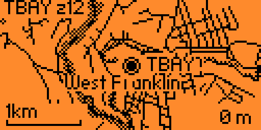
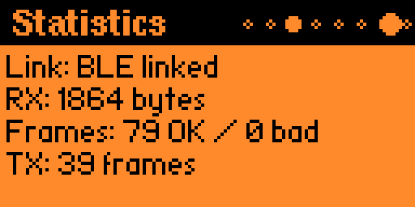
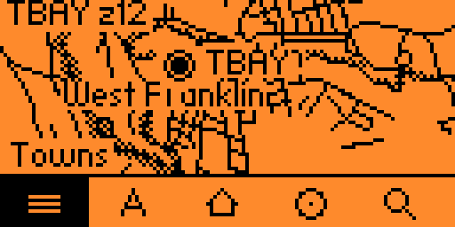

# ZeroMesh

A Meshtastic client for the Flipper Zero. Connects to a node over UART or Bluetooth LE and shows the mesh on the Flipper screen: messages, node roster, signal stats, telemetry, and an offline vector map.



## Power warning

The Flipper 5V pin is an output. Do not power a node from USB, a battery, or any other supply while it is connected to that pin. Multiple sources on the same rail back-feed and can damage the Flipper, the node's regulator, or the USB port. Use one supply at a time.

## Features

Eight pages navigated with left and right: Messages, Roster, Stats, Signal, Logs, Settings, Map and Node Config.

The roster tracks every node that has announced itself, with SNR, RSSI, battery and voltage. From there you can broadcast to the primary channel or open a private chat with any node. Long-pressing OK on Messages cycles up to 8 channels. Sent messages report delivery from routing acknowledgements.

Notifications are independent toggles for vibration, LED and audio, with 19 ringtones. Long messages either scroll or wrap, and the display compacts short ones to fit more on screen.

Settings persist to /ext/apps_data/zeromesh/settings.cfg automatically.


## Transports

Selected by the Transport setting.

**UART** is the default and works with stock Meshtastic firmware. Wire the node to the expansion header and pick USART or LPUART with a baud rate.



**Bluetooth LE** requires a Meshtastic build carrying the ZeroMesh link module. The Flipper radio can only act as a peripheral: it advertises and accepts connections but never dials out. A Meshtastic node is also a peripheral, so the two cannot meet directly. ZeroMesh instead publishes a GATT service and waits for the node to connect to it. Turn Bluetooth on in the Flipper settings first. While ZeroMesh holds the radio the Flipper is not reachable from the Flipper mobile app; the normal profile is restored on exit. No pairing or PIN.

## Wiring

| Node | Flipper |
| --- | --- |
| TX | RX (pin 13 or 14, depending on UART) |
| RX | TX (pin 13 or 14, depending on UART) |
| GND | GND |


The node also needs its serial module enabled, mode set to PROTO, and baud 115200.

## Installation

Copy the folder into `applications_user` in your Flipper firmware source, make sure `lib/meshtastic_api` and `lib/nanopb` are present, then:

```
ufbt launch
```

## Controls

| Page | Key | Action |
| --- | --- | --- |
| any | Left / Right | change page |
| Messages | OK | write a broadcast |
| Messages | OK long | cycle channel |
| Roster | OK | private chat with the selected node |
| Roster | OK long | node details, and Up opens it on the map |
| Chat | OK | send, Back returns to the roster |
| Logs | OK | pause or resume the stream |
| Settings | OK | edit, Left / Right change the value |
| Map | Up / Down | step between nodes reporting a position |
| Map | OK | cycle zoom |
| Map | OK long | pan mode, Back leaves it |
| Map | Down | toolbar: towns, labels, home, nodes, zoom |

Settings save when changed.

## Maps

The Map page draws an offline vector map and overlays roster nodes reporting a GPS position. It centres on a node rather than panning freely, and a dashed border marks the edge of the archive. Map data is optional; without it the page still opens and says so.



Archives are read from /ext/apps_data/zeromesh/map.pmtiles and must be built uncompressed, because the Flipper firmware has no gzip.

One command does everything, and copies the result to a plugged-in Flipper:

```
python tools/zeromesh_setup.py --place "Concord, New Hampshire" --radius 25 --install
```

There is also a [setup page](https://terminalbay.com/zeromesh.html) that sizes an area and writes the command for you. To drive the steps yourself:

```
python tools/fetch_tiles.py map --bbox -72.56,42.69,-70.70,45.31 --min-zoom 10 --max-zoom 12
python tools/build_pmtiles.py map map.pmtiles --simplify --max-tile-bytes 20736 --leaf-size 256
```

`--simplify` is worth passing for anything beyond a few tiles: it drops the layers the renderer never draws and detail finer than one screen pixel, and holds every tile under `--max-tile-bytes`, which must not exceed the on-device buffer. `--leaf-size` splits the directory into leaves paged in from the card; without it the whole directory must fit in RAM, capping an archive at a few hundred tiles.

A card reader is much faster than USB for anything beyond a handful of tiles.

## Node Config

Changes settings on the connected radio: LoRa region, modem preset, device role, GPS, a fixed position, the primary channel key, and whether position is shared on that channel.


**Fixed position** takes the coordinate under the map crosshair, so a node with no GPS fix can still appear on the map and report a location to the mesh. It overrides GPS; set it back to Off to remove it.

**Private channel** generates a random 256-bit key on the Flipper. Every other node on that channel needs the same key or it will stop hearing this one, and the key is not displayed, so share the channel from a device that can show it before relying on the change. Public restores the default key stock nodes ship with.

Channel and position settings are read back from the radio before being written, so an existing channel name and unrelated position fields survive a change.

## Troubleshooting

**No data received.** Check TX and RX are not swapped, the node's serial mode is PROTO, and the baud rate matches on both sides (115200 by default). The Logs page shows whether anything is arriving.

**Settings not saving.** Confirm the SD card is mounted. Deleting /ext/apps_data/zeromesh/settings.cfg and restarting resets them.

## License

GPL-3.0. Third-party components and their licenses are listed in [THIRD_PARTY_NOTICES.md](THIRD_PARTY_NOTICES.md).
