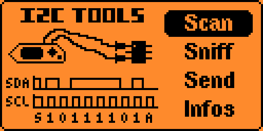
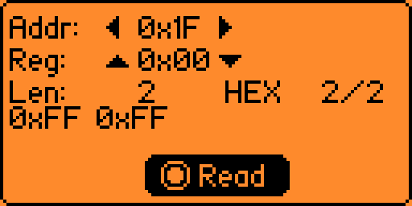
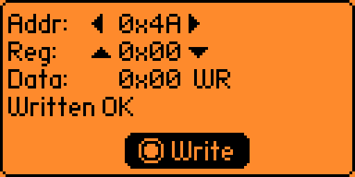
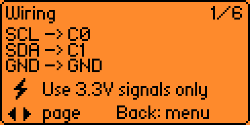

# I2C Tools CLI

A Flipper Zero external application that exposes I²C tools through both a **GUI** and a **serial CLI** (the *i2c* command over *ufbt cli* / VCP).

Forked from [NaejEL/flipperzero-i2ctools](https://github.com/NaejEL/flipperzero-i2ctools) (GPL-3.0). On top of the original scanner / sender / sniffer / infos views, this fork adds:

- **N-byte read** in the sender view (1..32 bytes, adjusted via Long Left / Long Right);
- **Write mode** toggle on the sender view (Long OK switches between READ and WRITE);
- **HEX / ASCII** display toggle (Long Back), with scrollable result paging (Long Up / Long Down);
- A **serial CLI** with subcommands **scan**, **probe**, **read**, **write**, **help**.

> ⚠ The Flipper external GPIO is **3V3 only**. Connecting a 5 V bus directly to SCL/SDA can damage the device. Use a level shifter for 5 V peripherals.

## Wiring

| Flipper pin | I²C signal |
|---|---|
| C0 | SCL |
| C1 | SDA |
| GND | GND |

Internal 10 kΩ pull-ups are enabled by the external I²C handle.

## Install

**From the Flipper Application Catalog** — search for **I2C Tools CLI** on the [Flipper catalog](https://catalog.flipperzero.one/) and install through qFlipper or the mobile app.

**From source (development)** — requires [ufbt](https://github.com/flipperdevices/flipperzero-ufbt).

    ufbt              # build → dist/i2c_tools_cli.fap
    ufbt launch       # build, upload, and start on a connected Flipper
    ufbt cli          # open the serial CLI (type: i2c help)

## Screenshots

<!-- See screenshots/README.md for the full capture checklist (8 PNGs at 128×64). -->

| | |
|---|---|
| Main menu |  |
| Scanner |  |
| Sender — read |  |
| Sender — write |  |
| Sniffer |  |
| Infos |  |

## CLI quick reference

    i2c scan                                    # list addresses that ACK
    i2c probe ADDR                              # present / absent
    i2c read  ADDR REG COUNT {hex|ascii}        # write reg → read N bytes
    i2c write ADDR REG BYTE {BYTE...}           # up to 32 payload bytes
    i2c help

All numeric arguments are hex (1A, 0x1A, 0X1a, …).

## Documentation

- [User guide](docs/USER_GUIDE.md) — every GUI key combination and every CLI subcommand, with examples.
- [Publishing guide](docs/PUBLISHING.md) — how this app is published to the Flipper Application Catalog and listed in awesome-flipperzero.
- [CHANGELOG](CHANGELOG.md)

## License

GPL-3.0 — inherited from upstream. See [LICENSE](LICENSE).
