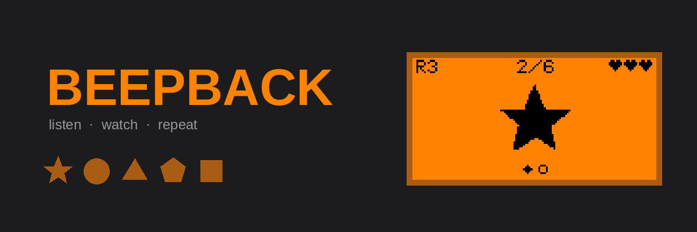
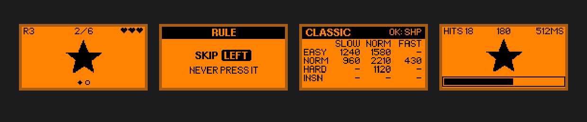

<p align="center">
  
</p>

<p align="center">
  <a href="https://github.com/h4sw5q2wr9-byte/BEEPBACK/blob/main/LICENSE"></a>
  
  
</p>

A memory game for Flipper Zero. Five buttons, five tones. The Flipper plays a
sequence and you play it back, one step longer every time.

Then it starts changing the rules on you.

<p align="center">
  
</p>

## Modes

| | |
|---|---|
| **CLASSIC** | The sequence grows a step at a time. Clear a round and a longer one begins. Three lives. |
| **RULES** | The same game, except every round hands you a rule to obey. `SKIP DOWN` means the sequence plays DOWN and you don't press it. Also SWAP, BACKWARDS, NO DOUBLES, EVERY OTHER, DOUBLE, LAST TWICE. |
| **REFLEX** | One cue at a time. Hit the matching button before the bar empties. The window shrinks with every hit; one miss ends the run. |
| **CHALLENGE** | Pick a rule and keep it. No rounds, no reset — one sequence that never stops growing. |
| **DAILY** | One rule, one seeded sequence, one attempt a day. Every Flipper in the world gets the same run. Resets at midnight. |

## Assists

| | |
|---|---|
| **EARS** | Tone only. The hardest way, and the one the game was built for. |
| **LED** | Each button lights its own colour. |
| **SHAPES** | A shape per button on screen. |
| **ARROWS** | The button itself, drawn. |

Records are kept separately for each, so playing by ear competes against playing
by ear.

**HAPTIC** is separate and works alongside any of them: the motor traces every
note of every pattern, so you can feel a sequence as well as hear it. With the
volume at zero it becomes an assist in its own right.

## Scoring

Ten points a note, a hundred for clearing a round. That's the whole system. TIME
and SPEED change how hard a run is, not what it pays, so the number on screen is
always one you could have worked out yourself.

## Building

Needs [uFBT](https://pypi.org/project/ufbt/).

```sh
pip install ufbt
ufbt update        # fetches the SDK
./build.sh         # runs the tests, then builds dist/beepback.fap
ufbt launch        # with the device plugged in
```

## Tests

```sh
./test/run_tests.sh
```

254 checks, no device needed. In order, the suite runs:

- a diff of the stub headers against the real firmware headers, so a drifted
  stub can't compile here and fail under uFBT
- `ufbt lint`, which is what the Apps Catalog gates submissions on
- a Cortex-M4F build of every source file with `-Werror`
- every undefined symbol checked against the firmware's export table — a `.fap`
  that calls something unexported builds, installs, and *then* refuses to start
- a full-firmware link check
- the logic and port suites, including a fake canvas that fails the build if any
  screen draws outside 128×64, if a string is wider than the screen, or if one
  string lands on another
- the whole thing again under AddressSanitizer and UBSan

The game logic touches no Flipper API. Time enters through `bb_tick(app, dt_ms)`
and hardware leaves through `app->tone_hz`, `app->led` and `app->buzz_until`,
which is what lets a run be played to completion on a host machine.

## Screenshots without a device

```sh
tools/shoot/shoot.sh
```

The Flipper draws with u8g2, and `canvas_set_font()` picks two stock u8g2 fonts.
So this isn't a mock-up: it sets up that same library against a 128×64 buffer,
implements the canvas API exactly as the firmware's `canvas.c` does, and calls
the app's real `bb_draw()`. What comes out is what the device shows, pixel for
pixel. `tools/shoot/promo.py` builds the art above from those same frames.

## Layout

| | |
|---|---|
| `beepback_app.c` | the only file that talks to the device |
| `beepback_game.c` | runs, from start to game over |
| `beepback_rules.c` | the seven rules, the windows, the seeded generator |
| `beepback_nav.c` | input |
| `beepback_draw.c` | every screen |
| `beepback_save.c` | the save file |
| `beepback_tables.c` | every constant table |
| `beepback_intro.c` | the splash |
| `beepback_led.c` | the five button colours and the motor |
| `HANDOFF.md` | the design notes, and what the browser build agreed to |
| `catalog/` | the Apps Catalog manifest and how to submit it |

## Credits

Made by **Tijnv50**, with Claude.

MIT licensed.
