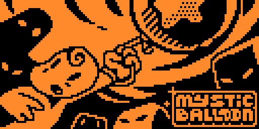
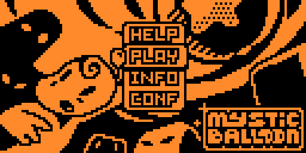
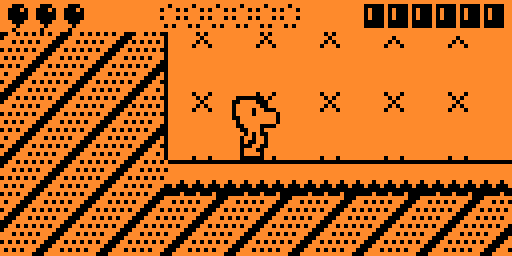
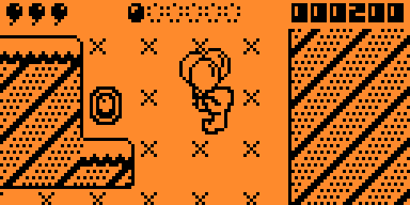
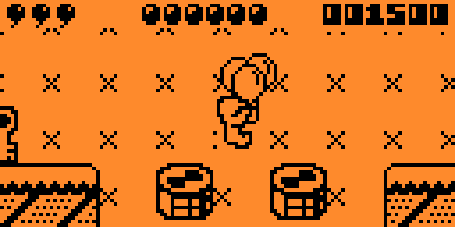
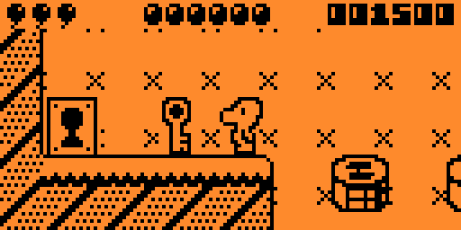
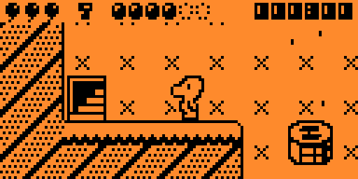
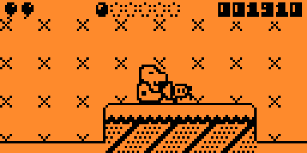
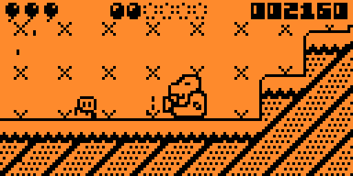
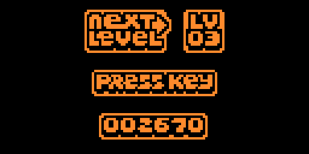

# Mystic Balloon

**Mystic Balloon** is an atmospheric 2D platformer featuring **39 levels**, each requiring precision, careful planning, and attention to detail.

The player controls a character who navigates the levels using **balloons**. The hero can **slowly descend while suspended by balloons** and **float above air currents created by fans**, using them to cross gaps and reach hard-to-access areas. At the start of each level, the character has **3 balloons**, which are essential for survival.

### Player objectives:

* Complete the level while **keeping as many balloons as possible**
* **Collect all the coins** in the level
* Avoid traps and dangerous obstacles

Every mistake may cost a balloon, so it’s important to think ahead and use the game’s physics to your advantage.

The game features a **save system** that stores unlocked levels and scores, allowing players to continue their progress at any time and aim for better results.

**Mystic Balloon** combines simple controls, gradually increasing difficulty, and tactical gameplay that rewards careful and thoughtful play.

## Controls

| Button | In game | In menu |
| ------ | ------- | ------- |
| **Left / Right** | Walk, steer in the air | — |
| **Up** | Look up, enter the door | Move the selector |
| **Down** | Look down | Move the selector |
| **OK** | Jump, hold to hover on a balloon | Confirm |
| **Back** | Hold to suck in coins and enemies | Cancel, exit on the main screen |
| **Back + Down** | Pause | — |

## Screenshots
|                                             |                                             |
| ------------------------------------------- | ------------------------------------------- |
|  |  |
|  |  |
|  |  |
|  |  |
|  |  |

## Original Project
**Team-ARG-Museum**
[Mystic Balloon](https://github.com/Team-ARG-Museum/ID-34-Mystic-Balloon/)