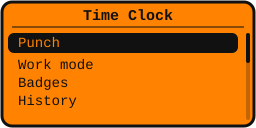
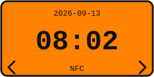
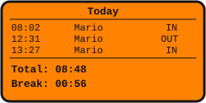
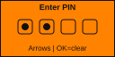
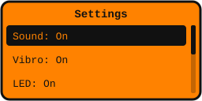

# Time Clock - Flipper Zero

[](https://github.com/vladpereverzyev/flipper-timeclock/actions/workflows/build.yml)
[](https://github.com/vladpereverzyev/flipper-timeclock/releases)
[](https://github.com/vladpereverzyev/flipper-timeclock/releases)
[](LICENSE)

A **staff time-clock** app for the [Flipper Zero](https://flipperzero.one/). Use it
to register your collaborators and log their clock in/out times: assign each
person a dedicated **blank** NFC or RFID badge, tap it, pick **IN** or **OUT**
(or let the app decide), and every punch is timestamped and stored on the microSD
card as a CSV timesheet you can open in Excel. It works fully standalone - no
phone or PC required.

> **Use blank/dedicated badges - authorized use only.** This app is meant to be
> used with **blank badges** that you assign to your collaborators. It only reads
> a badge's identifier (UID) to tell one collaborator from another: it is **not**
> for reading other people's access-control badges, it does **not** emulate
> badges, and it does **not** try to bypass any authentication system. Use only
> with badges and systems you are authorized to use. See [SECURITY.md](SECURITY.md).

## Screens

Flipper-style mockups of the main screens (128x64):

<table>
  <tr>
    <td align="center"><br><b>Main menu</b><br>Punch, Work mode, Badges, History...</td>
    <td align="center"><br><b>Work mode</b><br>Live clock, tap to punch</td>
  </tr>
  <tr>
    <td align="center"><br><b>Tap a badge</b><br>Welcome / Goodbye by name</td>
    <td align="center"><br><b>Today</b><br>Punches + total worked time</td>
  </tr>
  <tr>
    <td align="center"><br><b>PIN lock</b><br>Protects exit from the app</td>
    <td align="center"><br><b>Settings</b><br>Sound / Vibro / LED, PIN</td>
  </tr>
</table>

## Features (v1.0)

- **Punch** by tapping a badge - recognized badges are matched by UID.
- **Reader choice** in Settings: **NFC** (13.56 MHz) or **LF RFID** (125 kHz).
  The reader auto-detects whatever protocols the Flipper firmware supports.
- **Register a collaborator** the first time their blank badge is tapped, with a
  custom name. Each person is bound to that specific chip (its UID): every punch
  references that chip.
- **Manage collaborators (badges)**: rename, **replace the chip** if it is lost
  (keeps the person's name and history, only the chip changes), view per-person
  history, delete (history is kept).
- **Manual or automatic** IN/OUT - auto mode preselects the opposite of the last
  punch, and you can still correct it.
- **Feedback on punch**: distinct **sound**, **vibration** and **LED** for IN vs
  OUT (ascending tone + 1 buzz + green for IN; descending tone + 2 buzzes + blue
  for OUT), so a tap tells you which one it was. Each is toggleable in Settings
  (all on by default).
- **History** and a **Today** summary (first in, last out, total worked time).
- **Storage on microSD** as plain CSV, plus **JSON export**.
- **Protected mode (PIN)**: optional 4-digit PIN that gates leaving the app.

See [ROADMAP](#roadmap) for v1.1 / v2.0 ideas.

### One chip per person (and losing a chip)

Each collaborator is identified by their chip's **UID**, so assign one chip per
person and keep it as their reference - all of their punches point to that chip.
If someone **loses their chip**, open **Badges -> (person) -> Replace chip** and
tap a new blank chip: their name and past punches are kept, only the reference
chip is updated.

## Data files

Everything is stored on the microSD under `/ext/apps_data/timeclock/`:

| File          | Contents                                                        |
|---------------|-----------------------------------------------------------------|
| `badges.csv`  | Registered badges: `uid,name,tech,created,last_used,last_event` |
| `punches.csv` | Punch history: `date,time,name,uid,type` (`type` is `IN`/`OUT`) |
| `config.txt`  | Settings + PIN **hash** and salt (never the PIN itself)         |
| `export.json` | JSON export of the history (generated by *Export -> Export JSON*) |

`punches.csv` is the internal timesheet: every clock in/out for every
collaborator, by day and time. It opens directly in Excel, LibreOffice, Google
Sheets, etc.

Example `punches.csv`:

```csv
date,time,name,uid,type
2026-09-12,08:02,Mario,04A1B2C3D4,IN
2026-09-12,12:31,Mario,04A1B2C3D4,OUT
```

## Build & install

This is a Flipper **external app (FAP)** for the **official firmware**. Build it
with [`ufbt`](https://github.com/flipperdevices/flipperzero-ufbt):

```bash
python3 -m pip install --upgrade ufbt
```

From the project folder (the one containing `application.fam`):

```bash
ufbt
```

Deploy to a connected Flipper (launches it too):

```bash
ufbt launch
```

The built `.fap` lands in `dist/`. You can also copy it to
`SD Card/apps/Tools/` via qFlipper and run it from **Apps -> Tools -> Time Clock**.

> **Firmware note.** The radio layer lives in `timeclock_reader.c` (NFC via
> `NfcScanner` for full protocol coverage - ISO14443-A/B, FeliCa, ISO15693/NFC-V
> - plus the LF RFID worker). It is the part most sensitive to firmware API
> changes; if a symbol differs on your firmware/version, the fix is localized to
> that one file - the rest of the app does not depend on it.

## Compatibility

Time Clock works on the **official** Flipper Zero firmware and on the popular
custom firmwares. A FAP is compiled against a specific firmware API, so each
GitHub Release ships **one `.fap` per firmware** - just download the one that
matches what you run:

| Firmware    | Release asset               |
|-------------|-----------------------------|
| Official    | `timeclock-official.fap`    |
| Momentum    | `timeclock-momentum.fap`    |
| Unleashed   | `timeclock-unleashed.fap`   |
| RogueMaster | `timeclock-roguemaster.fap` |

RogueMaster is built on the Unleashed SDK (binary-compatible). For any firmware
not listed, build from source with `ufbt` (see above): the code targets standard
APIs and is written to be portable across firmwares.

## Protected mode & PIN - what it can and cannot do

When a PIN is set (*Settings -> Set PIN*), the app starts locked and **Back no
longer leaves the app**; the only software way out is *Settings -> Exit app*,
which asks for the PIN. The PIN is stored only as a **salted hash**.

**Honest limits (by design):**

- No app can stop a **hardware** power-off or a firmware-level force-quit
  (e.g. holding `Left` + `Back` to reboot, or removing power). Protected mode
  covers only the actions the app/firmware expose to software.
- The PIN hash (FNV-1a) prevents storing the PIN in clear text and gates the
  on-device UI. It is **not** a strong defense against an attacker with physical
  access to the SD card who brute-forces 4 digits offline.
- There is intentionally **no hidden PIN bypass**. Deleting
  `config.txt` on the SD card resets settings (and the PIN).

## Project layout

```
timeclock/
|-- application.fam            # app manifest
|-- timeclock.h / .c           # app lifecycle, entry point, shared helpers
|-- timeclock_storage.h / .c   # microSD persistence + data model
|-- timeclock_pin.h / .c       # salted PIN hashing
|-- views/
|   `-- pin_view.h / .c        # custom 4-digit PIN entry view
`-- scenes/
    |-- timeclock_scene*.{h,c} # scene manager wiring (X-macro)
    `-- timeclock_scene_*.c    # one file per screen
```

## Roadmap

- **v1.1** - weekly summary, break calculation, richer history filters.
- **v2.0** - Bluetooth sync, companion app, backup, advanced badge management.

## Contributing

Contributions are welcome - see [CONTRIBUTING.md](CONTRIBUTING.md) and the
[Code of Conduct](CODE_OF_CONDUCT.md).

## Support

If Time Clock is useful to you, you can support development:

[](https://github.com/sponsors/vladpereverzyev)
[](https://ko-fi.com/vladpereverzyev)

## License

Copyright (C) 2026 Vladyslav Pereverzyev.

Licensed under the **GNU General Public License v3.0 or later** - see
[LICENSE](LICENSE). Source files carry an `SPDX-License-Identifier: GPL-3.0-or-later`
header.
