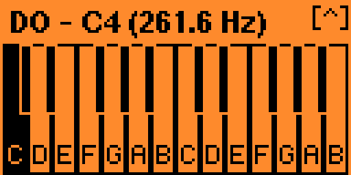
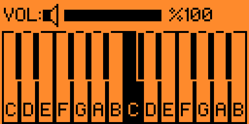

# 🎹 FlipPiano

14-key 2-octave mini piano application for **Flipper Zero**. 


play any song you want with a simple, handy mini piano app

---

## screenshots from the app

<p align="center">
  
  
</p>

---


---

##  Controls

| Button | Action |
| :--- | :--- |
| **Up / Down** | Change Octave / Pitch Shift |
| **Left / Right** | navigate piano keys |
| **OK ** | Play Selected Note / Tone |
| **Back** | Exit Application |

---

## 🛠️ How to Build & Install

If you want to compile and install manually using `ufbt`:

1. Clone this repository:
   ```bash
   git clone [https://github.com/bergr22/FlipPiano.git](https://github.com/bergr22/FlipPiano.git)
   cd FlipPiano
