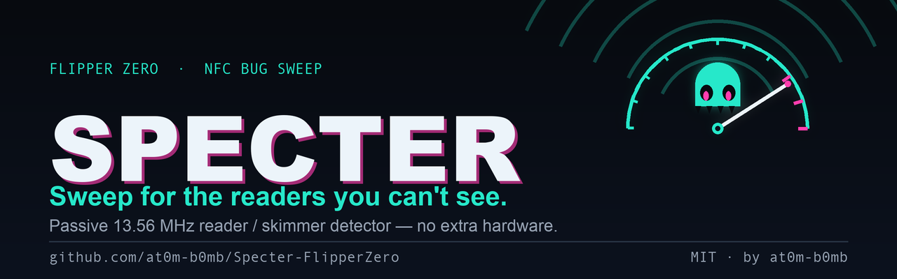
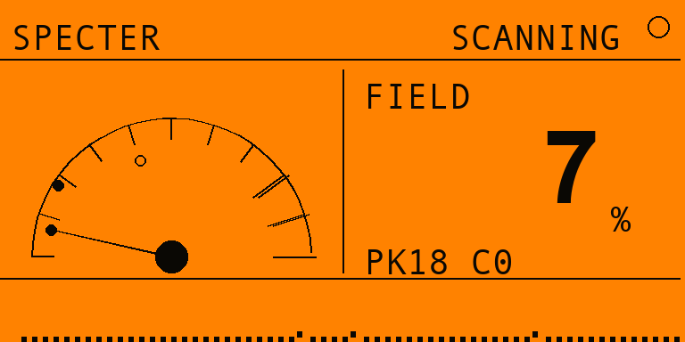
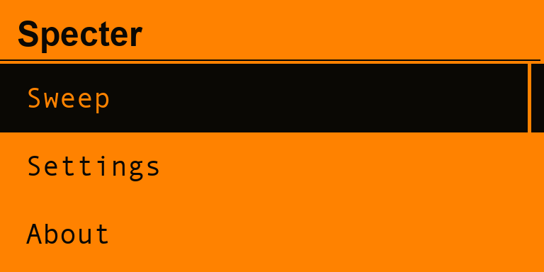
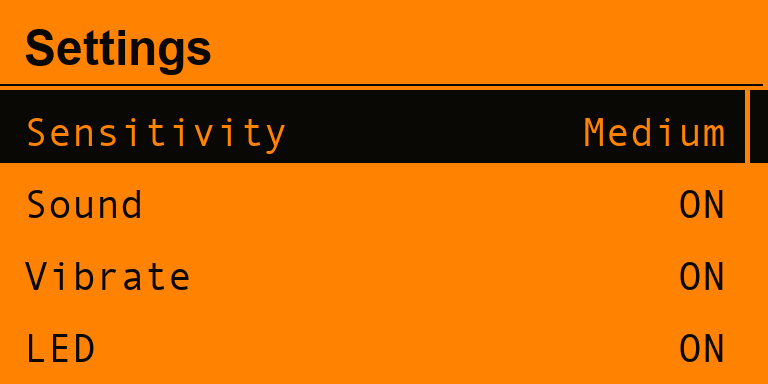
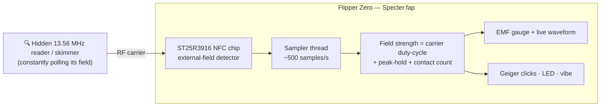

<!-- banner -->
<p align="center">
  
</p>

<h1 align="center">Specter 👻</h1>
<p align="center"><i>Sweep for the readers you can't see.</i></p>

<p align="center">
  
  
  
  
  
</p>

<p align="center">
  <b>Specter</b> turns your Flipper Zero into a pocket <b>counter-surveillance bug-sweep</b> for
  <b>active 13.56 MHz NFC readers</b>. It <i>passively listens</i> for the RF field that a powered-on
  reader is constantly emitting — a hidden card skimmer slipped into a payment terminal, a covert
  reader behind a door panel, a rogue logger taped under a desk — and turns it into a live
  <b>EMF-style meter</b> with geiger clicks that climb as you close in. It never transmits.
</p>

<p align="center"><sub>The readers are invisible. Specter makes them visible.</sub></p>

---

## 📟 On the Flipper

<p align="center">
  
  &nbsp;
  
  &nbsp;
  
  &nbsp;
  
</p>
<p align="center">
  <sub><b>Sweep</b> — quiet, scanning &nbsp;·&nbsp; <b>Reader!</b> — active field locked on &nbsp;·&nbsp; <b>Menu</b> &nbsp;·&nbsp; <b>Settings</b></sub>
</p>

---

## ✨ Features

- 📟 **The EMF gauge** — a beautiful analog-style sweep meter. The needle rides the **FIELD %** in real time, a peak-hold marker remembers the strongest hit, and the top of the dial is a **red "hot zone"**. A live waveform traces the noise floor while it's quiet.
- 👻 **Reader lock** — the instant an active reader's carrier is sensed, the screen frames itself in an **alarm border**, a throb ring pulses around the dial, and the strip flips to **`● ACTIVE READER`** with a proximity readout (`FAINT → NEAR → CLOSE → STRONG`).
- 🔊 **Geiger feedback** — optional clicks that **speed up as the field gets stronger**, so you can sweep a surface with the Flipper in your pocket and *hear* yourself getting warmer. Plus magenta LED + vibe on contact.
- 🎚️ **Tunable sensitivity** — **High / Medium / Low** noise floor, so you can chase faint distant readers or only flag strong ones right under your nose.
- 🔌 **Zero extra hardware** — uses the Flipper's **onboard ST25R3916 NFC chip**. Nothing to flash, nothing to wire, no devboard. Just install and sweep.
- 🕶️ **Listen-only & private** — Specter **never emits a field** and never talks to the reader. It only senses that one is *there*. Nothing is transmitted, logged off-device, or phoned home.

---

## 🧠 How it works

Every powered-on NFC reader continuously **pings the air with a 13.56 MHz carrier**, waiting for a card
to wake up. You can't see it, but the Flipper's NFC chip can: the **ST25R3916** has a hardware
**external-field detector** (the same circuit that lets the Flipper emulate a card and know when a reader
is talking to it). Specter parks the chip in detect-only mode and **samples that "field present?" bit
hundreds of times a second** — without ever switching on its own carrier.



**Strength = duty-cycle.** Over a short window Specter measures *what fraction of the time* a carrier is
present and smooths it into the **FIELD %**. A reader sitting right on top of the Flipper pegs the meter; a
weaker or intermittently-polling one further away nudges it. That percentage drives the needle, the
proximity word, and the click rate — so it behaves like a **bug detector / geiger counter for readers**.

---

## 🚀 Install

No devboard, no firmware to flash — it's a single `.fap`.

**Option A — prebuilt `.fap` (easiest)**

1. Grab `specter.fap` from the [**Releases**](https://github.com/at0m-b0mb/Specter-FlipperZero/releases) page.
2. Open **qFlipper**, drag the file onto `SD Card / apps / NFC /`.
3. On the Flipper: **Apps → NFC → Specter**.

**Option B — build it yourself with [`ufbt`](https://github.com/flipperdevices/flipperzero-ufbt)**

```bash
# one-time
python3 -m pip install --upgrade ufbt

# from the repo root, with your Flipper plugged in over USB:
ufbt            # build specter.fap into ./dist
ufbt launch     # build, upload to the Flipper and open it
```

The `.fap` lands in `dist/specter.fap`; `ufbt launch` copies it to `apps/NFC/` and starts it for you.

> Icons in `icons/`, screenshots and the banner in `images/` are generated — regenerate with
> `python3 tools_gen_icons.py`, `python3 tools_gen_mockups.py` and `python3 tools_gen_banner.py` (needs `pillow`).

---

## 🎮 Using it

1. Launch **Specter** and open **Sweep**.
2. Hold the Flipper flat and move it **slowly** across the thing you're checking — a card terminal, a door
   reader, the underside of an ATM lip, a parcel, a desk.
3. Watch the **FIELD %** and listen to the clicks:
   - **Quiet / flat waveform** → no active reader in range. You're clean.
   - **Needle climbing, clicks speeding up** → you're approaching an emitter. Keep moving toward the peak.
   - **`● ACTIVE READER` + alarm border** → an active 13.56 MHz reader is right here. The proximity word
     (`FAINT → STRONG`) tells you how close.
4. Press **OK** any time to **reset** the peak-hold and contact counter and start a fresh sweep.
5. Tune it in **Settings** — raise sensitivity to chase faint readers, lower it to ignore weak background.

> 💡 Sweep a known-good reader first (your own phone doing NFC, or a contactless terminal you trust) to
> see what a strong, legitimate field looks like on the meter. Then go hunting.

---

## 🔬 Honest limitations

- **13.56 MHz (HF) only.** Specter senses the **NFC band** — the one used by contactless payment skimmers,
  most modern access readers, transit and hotel readers. It **cannot** see **125 kHz (LF)** readers
  (older HID Prox / EM4100 door panels); the Flipper's LF path has no equivalent field-detect bit.
- **It senses a reader's *carrier*, not what it reads.** Specter tells you *an active reader is here and
  roughly how close* — it does not decode, identify, or capture anything the reader does.
- **Strength is relative, not calibrated.** `FIELD %` and the proximity words are a comparative "warmer /
  colder" guide for sweeping, not a measured distance in cm.
- **A reader must be powered and polling.** A dormant skimmer that only wakes on a real tap, or one that's
  shielded, may stay quiet. Absence of a reading isn't a guarantee of absence.
- **One radio at a time.** Specter takes over the NFC chip while sweeping, so close any other NFC app first
  (it'll say *NFC unavailable* if something else holds the radio).

---

## ⚖️ Legal & ethical

Specter is a **defensive, listen-only** tool — it **never transmits**, never powers a field, never touches
the reader. Use it to sweep **your own** POS area, door, desk or belongings, or hardware you're **explicitly
authorised** to assess. You are responsible for how you use it. Know your local laws.

---

## 🗺️ Roadmap

- [ ] Persist sensitivity / sound / vibe / LED across reboots
- [ ] "Logbook" of detections with timestamps to the SD card
- [ ] Background sweep with screen off + buzzer-only "tricorder" mode
- [ ] Adjustable detector hardware threshold for finer range control
- [ ] Investigate an LF (125 kHz) coil-based reader sense as a separate mode

---

## 🗂️ Project layout

```
Specter-FlipperZero/
├── application.fam            # Flipper app manifest (category: NFC)
├── specter.c / specter_i.h    # app entry, wiring, alert feedback
├── helpers/
│   └── field_detector.{c,h}   # worker thread: samples the NFC field-present bit
├── views/
│   └── sweep_view.{c,h}       # the EMF gauge / waveform / alarm screen
├── scenes/                    # scene-manager navigation (start · sweep · settings · about)
├── icons/                     # 1-bit Flipper icons (generated)
├── images/                    # banner + screen mockups (generated)
└── tools_gen_*.py             # regenerate icons / mockups / banner
```

---

## 🙏 Credits

- Built by **[at0m-b0mb](https://github.com/at0m-b0mb)**.
- Part of a Flipper security-tool family: **[Argus](https://github.com/at0m-b0mb/Argus-FlipperZero)** (Wi-Fi deauth / evil-twin watchdog), **[GhostTag](https://github.com/at0m-b0mb/GhostTag-FlipperZero)** (BLE anti-stalking hunter) and **[Cerberus](https://github.com/at0m-b0mb/flipper-cerberus)** (Sub-GHz RF watchdog).
- Powered by the [Flipper Zero firmware](https://github.com/flipperdevices/flipperzero-firmware) NFC HAL (`furi_hal_nfc` field detection) + [ufbt](https://github.com/flipperdevices/flipperzero-ufbt).

## 📄 License

[MIT](LICENSE) © 2026 at0m-b0mb
