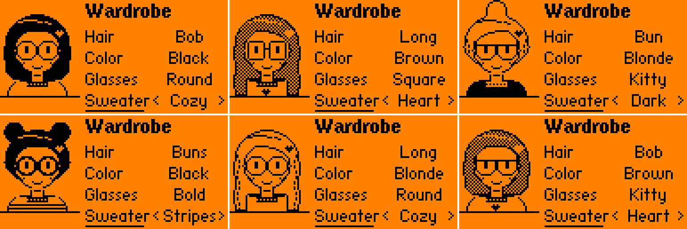
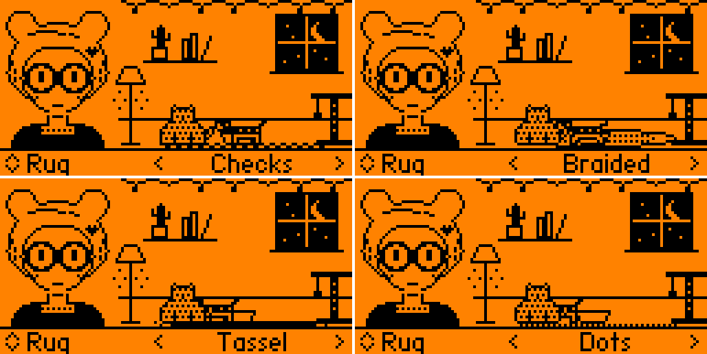
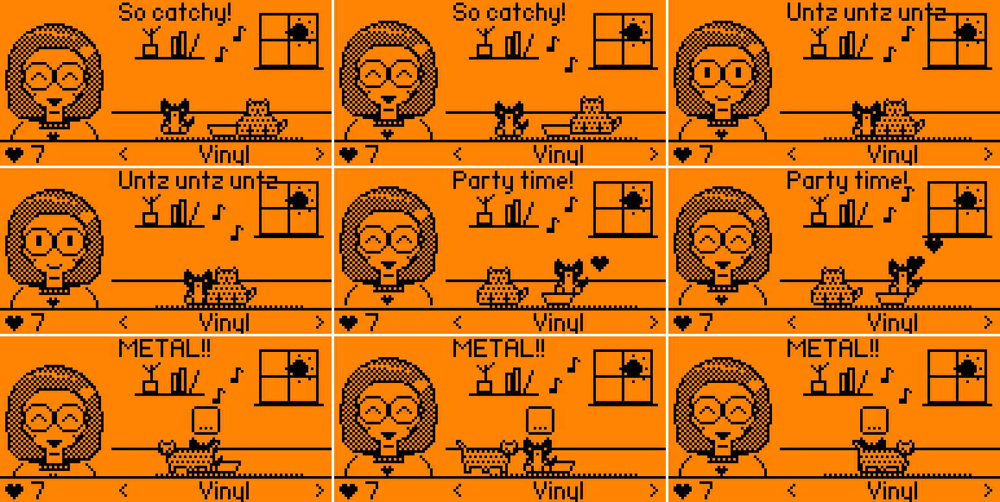
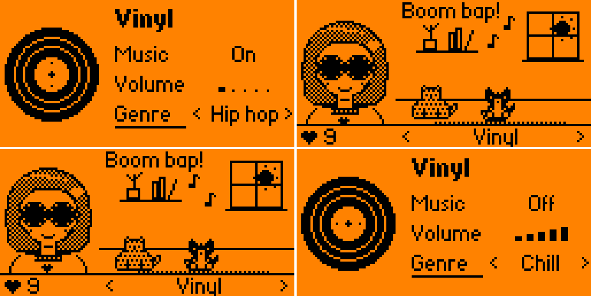
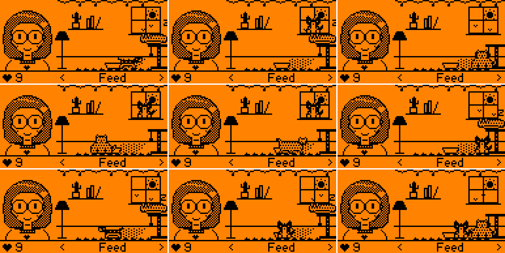
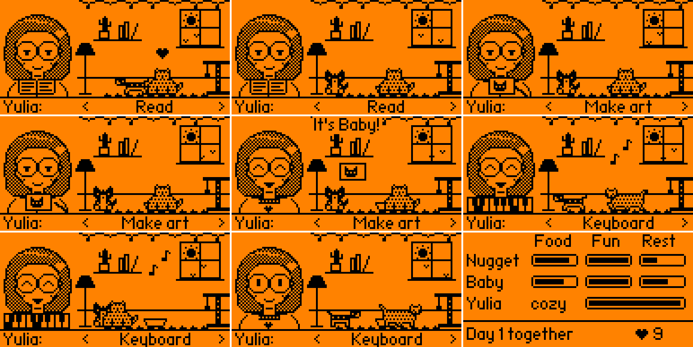
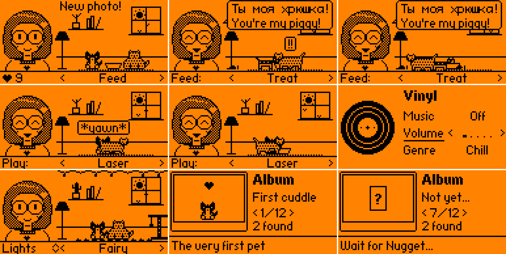
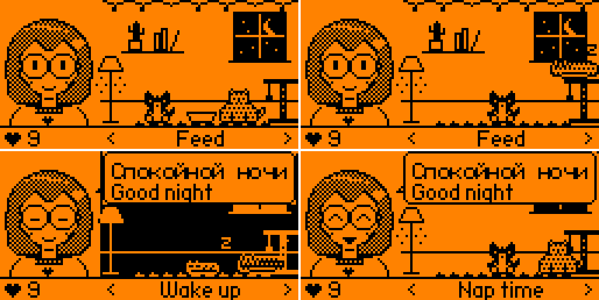

# Yulia's Cats

A cozy virtual pet for the Flipper Zero. Yulia shares a little room with her
two cats: **Nugget**, an elderly tiger-striped gentleman with white socks, and
**Baby**, a chonky grey cat with a little face and big bright eyes.


















## Playing

| Button       | Action                                      |
| ------------ | ------------------------------------------- |
| Left / Right | Choose a group, or a choice inside a group  |
| OK           | Open the group / do it                      |
| Back         | Leave the group; from the top, save & quit  |
| Up / Down    | Show how everyone's doing                   |

- **Feed** - *Dinner* fills the bowl for both cats. *Treat* hands out a
  biscuit each: Baby is there before the bag is open.
- **Play** - *Yarn* for both cats to chase, or the *Laser* dot, which Baby
  cannot resist and Nugget cannot be bothered with.
- **Pet** - *Nugget* or *Baby*. Hearts float up and the Flipper purrs.
- **Yulia** - *Tea*, *Read* a book, *Make art* (she holds up the finished
  portrait) or play her *Keyboard* through the speaker. A cat that is free
  comes to keep her company.
- **Home**
  - *Wardrobe* - nine hair styles (bob, long, bun, buns, pixie, ponytail,
    braids, curly, bangs) in three colours, nine choices of glasses (round,
    square, kitty, bold, tiny, oval, heart, shades, or none) and nine
    sweaters (cozy, stripes, heart, dark, dots, zigzag, cat, star, checks).
  - *Decor* - one of seven rugs (dots, stripes, oval, zigzag, checks,
    braided, tassel) or none, a shelf plant, a cat tree and fairy lights,
    chosen in the room itself.
  - *Vinyl* - optional background music on the Flipper's speaker: on/off,
    volume, and a genre (lo-fi Chill, Hip hop, Pop, House, Party, Metal).
    Yulia and the cats react for a few seconds whenever a new record goes
    on, differently for each genre. The music rests during naps and stays
    silent in stealth mode.
  - *Album* - twelve photos, each unlocked by a little milestone.
- **Nap time** - lights off, everyone sleeps. Choose it again to wake up.

### The cats

Left alone, the cats get on with their day:

- **Nugget** watches the birds from the window sill, keeps an eye on the
  empty food dish (and on Yulia), and sometimes goes to sit with Baby. He
  walks slowly and tires sooner.
- **Baby** naps in the patch of afternoon sun or on the cat tree, follows
  Nugget around, and takes his spot by the food dish whenever he finds one.
  She is always ready for a snack.

### Day and night

The room follows the Flipper's clock: the sun crosses the window through
the day and lays a warm patch on the floor in the afternoon; in the evening
the sky goes dark, the moon comes out and the lamp is lit; late at night the
cats get sleepy on their own.

### Yulia speaks Russian

Now and then Yulia says something to the cats in Russian - calling one of
them a piggy over treats, for instance. The bubble shows the Russian with
the English underneath. (The Flipper's fonts have no Cyrillic, so the
phrases are rendered to bitmaps by the sprite tool.)

Time keeps passing while the app is closed, so the cats get hungry and want
to play, but nothing bad ever happens to them.

Progress is saved to `apps_data/yulia_cats/save.bin` on the SD card.

## Building

```sh
ufbt launch
```

The artwork is generated by `tools/build_sprites.py` (needs Pillow, and
macOS for the Monaco font used for the Russian phrases), which writes
`sprites.h` and `icon.png`:

```sh
python tools/build_sprites.py --preview sheet.png
```

## License

MIT
