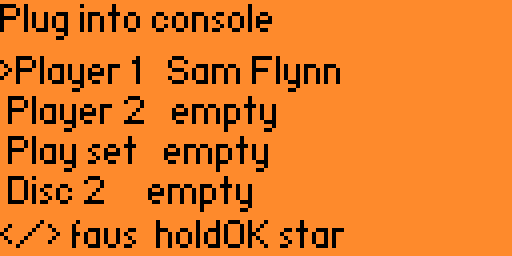
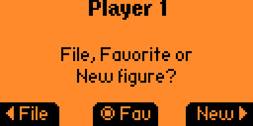
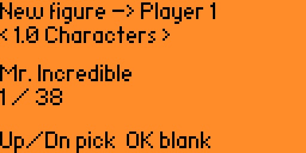

# FlipBase

A Flipper Zero app that acts as a **Disney Infinity base** over USB, so the
game sees characters, play sets and power discs without a physical base.

> **Status:** tested working on Disney Infinity 1.0, 2.0 and 3.0 (characters, play sets, power
> discs). Unofficial, not affiliated with or endorsed by Disney. (not tested and highly unlikely to work with xbox systems) 

## Screenshots

| Main menu | Pick a source | New figure |
| --- | --- | --- |
|  |  |  |

## Use

1. **Install** (works on the official/stock Flipper firmware, no custom firmware needed):
   1. Install [uFBT](https://github.com/flipperdevices/flipperzero-ufbt) (needs Python 3):
      `python3 -m pip install --upgrade ufbt`
   2. Make sure your Flipper's firmware is up to date (qFlipper), then in a terminal run
      `ufbt update` once. This downloads the SDK for the current official **release** firmware.
      If you run the official **dev** build instead, use `ufbt update -c dev`. The SDK must match
      the firmware version on your Flipper.
   3. In this folder run `ufbt`. This produces `dist/flipbase.fap`.
   4. Copy `flipbase.fap` to `SD:/apps/USB/` on the Flipper, using qFlipper's file manager
      (or the SD card in a reader). With the Flipper plugged in you can also run `ufbt launch`
      to build, install and start it in one step.

   *Using a custom firmware (Momentum, Unleashed, etc.)?* Point uFBT at that firmware's SDK
   instead, e.g. `ufbt update --index-url=https://up.momentum-fw.dev/firmware/directory.json`.
2. Open **Apps → USB → FlipBase**, plug the Flipper into the console, start the game.
3. Pick a row (Player 1/2, Play set, Disc slots). **OK** on an empty row: **File** (a 320-byte
   `.bin` from `SD:/apps_data/flipbase/`), **Fav** (favorites list) or **New** (a blank
   figure from the built-in list: every character, play set and power disc for Infinity 1.0, 2.0 and 3.0;
   **Left/Right** switches between them).
4. **Left/Right** swaps through favorites, **hold OK** stars the figure, **hold Right** saves
   `debug.txt`. The game's progress is written back to the figure's file on the SD card.

The top line shows the connection state and buzzes when a working connection drops.

## Notes

- **New** figures are generated blank in memory and are **not saved** to the SD card, so the game's progress on
  them is lost when you remove them or close the app. To keep progress, load a `.bin` with **File** instead.
  Figures you create contain no game data. **Do not upload figure files or logs.**
- Keep your own backups of `apps_data/flipbase`.
- The USB protocol, the figure format and the figure list follow
  [RPCS3](https://github.com/RPCS3/rpcs3)'s Disney Infinity emulation (`Infinity.cpp`,
  `infinity_dialog.cpp`). The `tests/` folder checks this code byte-for-byte against RPCS3's own
  code (`make RPCS3=/path/to/rpcs3` in `tests/`).

## Related projects

- [Disney-Infinity-NFC](https://github.com/skylandersNFC/Disney-Infinity-NFC) — a separate,
  unaffiliated project with its own tools and figure dump collection. Linked for reference only.
  **FlipBase does not use, include, bundle, or depend on any of that project's dump files** —
  figures here are generated blank from the public figure list, not copied from real figures.

## License

GPL-2.0-only (see `LICENSE`), because it derives from RPCS3. Disney and Disney Infinity are
trademarks of their owners; they are named here only to say what the app works with.
