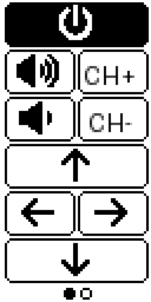

# IR Pad

A customizable, **portrait** IR remote for the Flipper Zero. Hold the Flipper
upright and use it like a real remote: a vertical stack of buttons, each either
**long** (full width) or **short** (two per row), showing an **icon** (or text
if no icon). Buttons transmit IR signals loaded from your saved `.ir` files.



## Features
- Portrait (vertical) layout — the whole UI is rotated
- Long / short buttons, auto-arranged into rows
- **Pages**: long-press Left/Right to flip pages; dot indicator
- Multiple remotes, each its own layout file
- Icon-or-text per button
- Transmits parsed **and** raw signals (parses `.ir` directly; the firmware's
  `infrared_signal` API is disabled for faps, so IR Pad uses the low-level
  `infrared_send` / `infrared_send_raw_ext`)
- **Launch argument**: open a `.irr` layout or a raw `.ir` (auto-built remote)
  directly — integrates with [Fav Launcher](../flipper-fav-launcher), which routes IR
  favorites here when installed. **Exact match**: opening `/ext/infrared/Foo.ir`
  uses `apps_data/irpad/Foo.irr` if it exists (same basename, 1:1, no mixing),
  otherwise an auto-built remote. LED blinks on each transmit.

## Controls
- **OK** — transmit the focused button
- **▲ ▼** — move within the page · **◄ ►** (short) — switch the two shorts in a row
- **◄ ►** (long) — previous / next page
- **Back** — remote list (or exit, when opened via a launch argument)

## Build
ufbt against the **Unleashed** SDK (Target 7 / API 88.9):
```bash
python3 -m venv venv && ./venv/bin/pip install ufbt
UFBT_HOME=.ufbt ./venv/bin/ufbt update \
  --index-url=https://up.unleashedflip.com/directory.json --channel=release
UFBT_HOME=.ufbt ./venv/bin/ufbt   # -> dist/irpad.fap
```

## Install (qFlipper)
1. `dist/irpad.fap` -> SD `apps/Infrared/`
2. `assets/icons/` -> SD `apps_data/irpad/icons/`
3. `assets/remotes/*.irr` -> SD `apps_data/irpad/`
Then `Apps -> Infrared -> IR Pad`.

## Remote config (`.irr`, FlipperFormat)
```
Filetype: IR Remote Layout
Version: 1
Name: Samsung TV
Size: long            # or short
Icon: power-off       # icon name in icons/ , or - for none
Text: Power           # shown if no icon , or -
File: /ext/infrared/Samsung_QN43Q60AAF.ir
Signal: Power         # signal name inside that .ir
# ... repeat per button
```
Buttons flow top-to-bottom; a `long` takes a full row, two `short`s share a row.
6 rows per page.

## Icons
The icon set is original, hand-drawn at 16x16 for this project (MIT, same as the code) — no third-party icon license.
