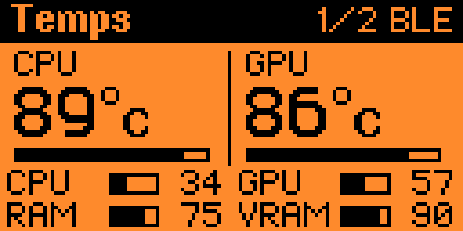
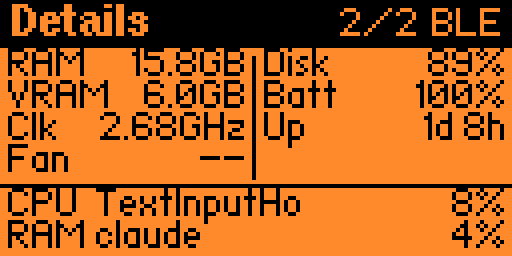
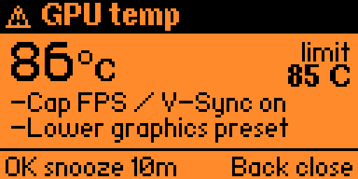
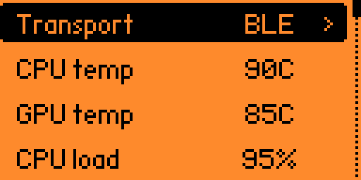
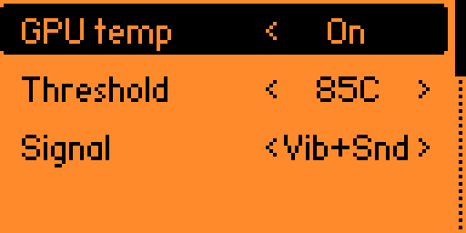

# PC Health Remote

**Your PC's temperatures and load on a Flipper Zero, with vibration, sound and LED alerts when something goes wrong.**

<p align="center">
  
  
  
  
  
</p>

PC Health Remote has two parts:

* a **Flipper Zero app** (`pc_health_remote`, category *Bluetooth*, v1.0) that shows the dashboard and raises alerts;
* a small **PC backend** (`pc-health-remote.exe`, written in Rust, a Windows tray app; Linux is best-effort) that reads
  your sensors and streams them to the Flipper over Bluetooth LE or USB.

English | [Русский](README.ru.md)

## Features

* **Temps page** - CPU and GPU temperature plus CPU, GPU, RAM and VRAM load bars.
* **Details page** - RAM and VRAM totals, CPU clock, fan speed, disk usage (%), battery, uptime,
  and the top CPU and top RAM process.
* **Alerts** - nine rules, each with its own on/off switch, threshold and signal
  (Vibro, Sound, Vib+Snd, LED, Off). The alert screen shows the current value versus the limit and 2 short tips.
  `OK` snoozes the alert for 10 minutes, `Back` closes it.
* **Bluetooth LE (default) or USB** transport. Settings are saved on the Flipper's SD card.
* **Silent reconnects** - pair once; afterwards the PC reconnects by itself whenever you open the app.
* **Autostart** - the backend can install itself as a Task Scheduler task that runs at logon.
* Works with the **official firmware** (SDK API 87.1, fw 1.4.3) and **RogueMaster** (API 88.4).

## How it works

The backend samples the PC about once a second and sends a fixed-size, CRC-protected telemetry frame to the
Flipper. The Flipper answers with a HELLO frame (which also tells the backend the update interval). If no valid
telemetry arrives for a while, the app shows "PC lost". The wire format is documented in
[docs/PROTOCOL.md](docs/PROTOCOL.md).

Sensor sources on Windows:

| Value | Source |
|-------|--------|
| CPU temperature | [LibreHardwareMonitor](https://github.com/LibreHardwareMonitor/LibreHardwareMonitor) via WMI if it is running (most accurate, CPU package); otherwise the Windows ACPI thermal zone |
| GPU temperature, load, VRAM | NVIDIA NVML - **NVIDIA GPUs only**; other GPUs show `--` |
| Fan RPM | LibreHardwareMonitor only |
| CPU/RAM/disk load, battery, uptime, processes | Windows |

## Quick start

Full walkthrough with screenshots: **[docs/SETUP.md](docs/SETUP.md)**.

1. **Install the Flipper app.** Get `pc_health_remote.fap` from the
   [latest release](https://github.com/vladatman/pc-health-remote/releases) and copy it to
   `/ext/apps/Bluetooth/` (for example with qFlipper -> *Install from file*), or install it from the Flipper app catalog.
2. **Download the backend.** Grab the Windows exe from the same
   [releases page](https://github.com/vladatman/pc-health-remote/releases) and put it somewhere permanent, for example
   `C:\Tools\pc-health-remote\pc-health-remote.exe` (the release asset is named
   `pc-health-remote-windows-x86_64.exe`; rename it if you like).
3. **Pair once.** Open *PC Health Remote* on the Flipper, then in PowerShell run:
   ```powershell
   .\pc-health-remote.exe pair
   ```
   The Flipper shows **Verify code** - press **OK** on the Flipper. Windows shows nothing; the backend accepts the
   request itself.
4. **Run it.** `.\pc-health-remote.exe` starts the tray app. Whenever the app is open on the Flipper, the connection is
   made automatically and silently.
5. **Autostart (optional).** From an **elevated** PowerShell, run once:
   ```powershell
   .\pc-health-remote.exe install
   ```
   This creates a Task Scheduler task that starts the backend at logon with highest privileges.
   `pc-health-remote.exe uninstall` removes it.

For the best CPU temperature (and fan speed), also run LibreHardwareMonitor - see [docs/SETUP.md](docs/SETUP.md).

## Alerts and defaults

Press `OK` on the dashboard to open settings. Defaults:

| Rule | Default limit | Must hold for | Signal | Enabled |
|------|---------------|---------------|--------|---------|
| CPU temperature | 90 C | - | Vib+Snd | yes |
| GPU temperature | 85 C | - | Vib+Snd | yes |
| CPU load | 95 % | 30 s | Vibro | yes |
| GPU load | 98 % | 30 s | Vibro | **off** |
| RAM load | 90 % | 10 s | Vibro | yes |
| VRAM load | 95 % | 10 s | Vibro | yes |
| Disk used | 95 % | - | Sound | yes |
| Battery low | 20 % (only while on battery) | - | Vib+Snd | yes |
| PC link lost | 10 s without data | - | Vib+Snd | yes |

Limit and signal are adjustable per rule. Each rule can be switched on or off.

## Command-line reference

```
pc-health-remote [run]      tray app (default)
pc-health-remote pair       pair with the Flipper (app must be open on it)
pc-health-remote unpair     forget the pairing
pc-health-remote metrics    print one JSON snapshot and where each value came from
pc-health-remote status     config, pairing, USB ports, task state, running instances
pc-health-remote install    create the logon task (run once, elevated)
pc-health-remote uninstall  remove the logon task
```

Useful flags: `--simulate` (synthetic changing values, handy for testing alerts), `--console` (show the log in a
console), `--transport auto|ble|usb`. More details in [backend/README.md](backend/README.md).

Config and log live in `%APPDATA%\pc-health-remote\` (`config.toml`, `log.txt`).

## Build from source

**Flipper app** (needs [ufbt](https://pypi.org/project/ufbt/)):

```bash
pip install ufbt
cd flipper
ufbt                 # builds dist/pc_health_remote.fap
ufbt launch          # build, upload and run on a connected Flipper
make -C tests        # host-side unit tests (protocol + alert engine)
```

To build against a custom firmware's SDK (for example RogueMaster), keep that SDK in its own directory by setting
`UFBT_HOME` before running `ufbt update` (use the SDK index/channel that firmware publishes; see
`ufbt update --help`), then build as usual:

```powershell
$env:UFBT_HOME = "C:\ufbt-custom-fw"
ufbt update --index-url=<SDK index URL of your firmware>
ufbt
```

Keep the same `UFBT_HOME` set for later builds so ufbt keeps using that SDK. The reference builds target the official
SDK (API 87.1) and RogueMaster (API 88.4).

**PC backend** (Rust 1.90 or newer):

```bash
cd backend
cargo build --release     # target/release/pc-health-remote(.exe)
cargo test
```

On Linux install `libdbus-1-dev libudev-dev pkg-config` first. The tray icon is Windows-only.

## Troubleshooting

See the troubleshooting table in [docs/SETUP.md](docs/SETUP.md#troubleshooting).

## Protocol

[docs/PROTOCOL.md](docs/PROTOCOL.md) describes the frames exchanged between the PC and the Flipper.

## Contributing

Issues are welcome - bug reports, hardware reports (firmware, Windows version, GPU) and ideas. An automated bot
triages new issues daily. Pull requests are appreciated; please run `make -C flipper/tests` and `cargo test` first.

## License

[MIT](LICENSE) (c) 2026 vladatman
