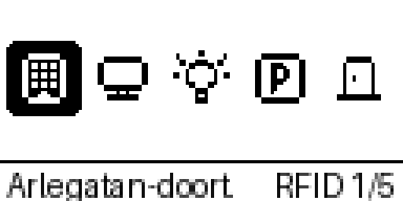
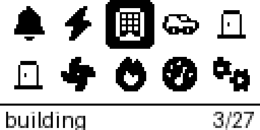

# Flipper Fav Launcher (flauncher)

A custom launcher app for the Flipper Zero that replaces the look of the stock
Archive **Favorites** list with a **2×5 icon grid**. Each favorite gets an
assignable icon; select with the D-pad and launch it in its native app
(Infrared / Sub-GHz / NFC / 125 kHz RFID / iButton).





## Features
- Imports the existing favorites directly from `/ext/favorites.txt` (no re-entry)
- 2 rows × 5 columns matrix, D-pad navigation (not page-by-page)
- Filled rounded selection box with inverted icon
- Per-favorite icons via a simple config file
- Launches the target in its own app using the loader deferred-launch queue
- **On-device icon picker**: long-press OK on a favorite to choose its icon from a grid; saved to `icons.txt`
- Returns to the grid after the launched app exits
- Pixelart icon set (with a few FontAwesome fallbacks)

## Build
Built with [ufbt](https://pypi.org/project/ufbt/) against the **Unleashed**
SDK (Target 7, API 88.9).

```bash
python3 -m venv venv && ./venv/bin/pip install ufbt
# point ufbt at the firmware you run (example: Unleashed release channel)
UFBT_HOME=.ufbt ./venv/bin/ufbt update \
  --index-url=https://up.unleashedflip.com/directory.json --channel=release
UFBT_HOME=.ufbt ./venv/bin/ufbt            # builds dist/flauncher.fap
```
Rebuild against your own firmware's SDK if your API version differs.

## Install (via qFlipper)
1. Copy `dist/flauncher.fap` → SD `apps/Tools/`
2. Copy `assets/icons/` → SD `apps_data/flauncher/icons/`
3. Copy `assets/icons.txt` → SD `apps_data/flauncher/icons.txt`
4. On the Flipper: `Apps → Tools → Fav Launcher`

## IR Pad integration

If `IR Pad` (irpad.fap) is installed at `/ext/apps/Infrared/irpad.fap`, IR favorites open in it; otherwise they open in the stock Infrared app.

## Config
`icons.txt` maps a favorite path to an icon name (file in `icons/`, no extension):
```
/ext/subghz/Garage.sub=square-parking
/ext/infrared/Samsung_QN43Q60AAF.ir=tv
```
Unmapped favorites fall back to a per-type default. Add a new favorite in the
Archive and it shows up automatically.

## Icons
Monochrome `.bm` (1-byte flag + 18×18 XBM). Add your own with `tools/pxrender.py`
(rasterizes [Pixelarticons](https://github.com/halfmage/pixelarticons) SVGs).

## Controls
- **◄ ► ▲ ▼** — move selection
- **OK** (short) — launch the selected favorite
- **OK** (long) — open the icon picker for the selected favorite
- **Back** — exit (in the picker: cancel)

## Credits
- Icons: [Pixelarticons](https://github.com/halfmage/pixelarticons) (MIT),
  some [Font Awesome Free](https://fontawesome.com) (CC BY 4.0)
- Launcher pattern inspired by the Flipper Zero Archive favorites
