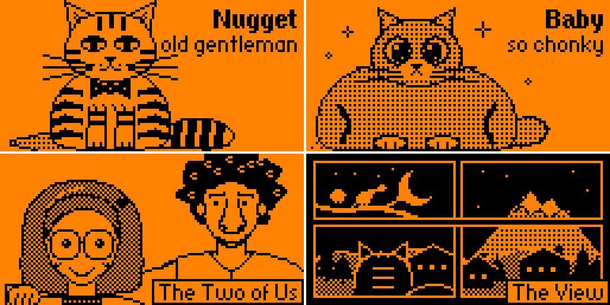
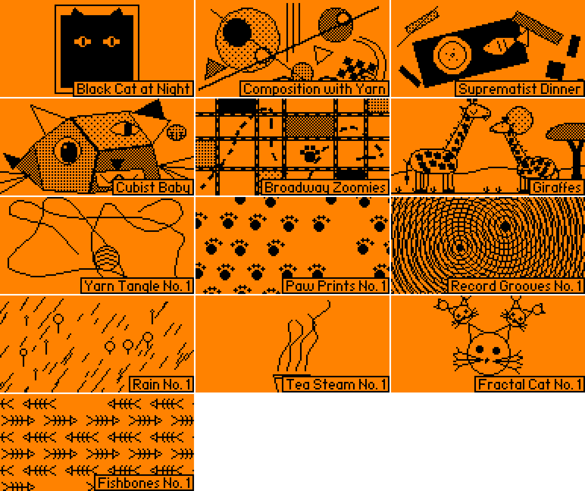
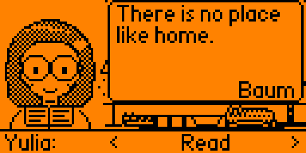
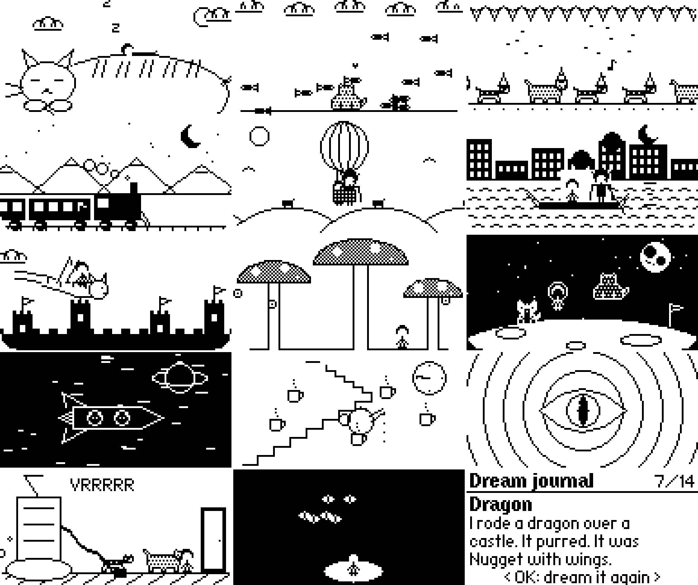

# Yulia's Cats

A cozy virtual pet for the Flipper Zero. Yulia shares a little room with her
two cats: **Nugget**, an elderly tiger-striped gentleman with white socks, and
**Baby**, a chonky grey cat with a little face and big bright eyes.










## Playing

| Button       | Action                                      |
| ------------ | ------------------------------------------- |
| Left / Right | Choose a group, or a choice inside a group  |
| OK           | Open the group / do it                      |
| Back         | Leave the group; from the top, save & quit  |
| Up / Down    | Show how everyone's doing                   |

- **Feed** - *Dinner* fills the bowl for both cats. *Treat* hands out a
  biscuit each: Baby is there before the bag is open.
- **Play** - *Yarn* for both cats to chase, or the *Laser* dot, which Baby
  cannot resist and Nugget cannot be bothered with.
- **Pet** - *Nugget* or *Baby*. Hearts float up and the Flipper purrs.
- **Yulia** - *Tea*, *Read* a book, *Make art* (she holds up the finished
  portrait) or play her *Keyboard* through the speaker. A cat that is free
  comes to keep her company. While she reads, the page shows a line or two
  from an old favourite (Austen, Carroll, Tolstoy, Dostoevsky, Mary Shelley,
  Confucius, Lao Tsu, Kipling's cat who walks by himself, and more), and the title comes up when she closes the book.
  When she finishes a piece of art she holds it up, full screen, for a few
  seconds (any button puts it down).
- **Home**
  - *Wardrobe* - nine hair styles (bob, long, bun, buns, pixie, ponytail,
    braids, curly, bangs) in three colours, nine choices of glasses (round,
    square, kitty, bold, tiny, oval, heart, shades, or none) and nine
    sweaters (cozy, stripes, heart, dark, dots, zigzag, cat, star, checks).
    Behind the shades her eyes only show when she smiles, blinks or dozes.
  - *Decor* - one of seven rugs (dots, stripes, oval, zigzag, checks,
    braided, tassel) or none, a shelf plant, a cat tree and fairy lights,
    chosen in the room itself.
  - *Vinyl* - optional background music on the Flipper's speaker: on/off,
    volume, and a genre (lo-fi Chill, Hip hop, Pop, House, Party, Metal).
    Yulia and the cats react for a few seconds whenever a new record goes
    on, differently for each genre. The music rests during naps and stays
    silent in stealth mode.
  - *Album* - fifteen photos, each unlocked by a little milestone. One
    is for reading every book on the shelf, one for filling the sketchbook
    and one for filling the dream journal; Yulia reads, draws and dreams
    the ones she has not done first.
  - *Sketchbook* - everything Yulia has drawn, seventeen pages in all. Left
    and Right turn the pages.
  - *Journal* - her dream journal, a page for every dream she has had.
    Left and Right turn the pages; OK on a written page plays the dream
    again.
- **Nap time** - lights off, everyone sleeps. Choose it again to wake up.
  A moment after the lights go out Yulia drifts off and dreams, and the
  dream plays out on the screen (any button cuts it short).

### Yulia's dreams

Fourteen dreams, each a little moving picture, written up in her journal
afterwards. She has the ones she has not had before first:



- **The cats:** Nugget the size of a hill, a rain of fish for Baby, and a
  parade of cats in party hats
- **Away with him:** a night train through the mountains, a balloon over
  the hills (he waves at every cow), and a gondola in Venice
- **Fantasy:** a dragon ride over a castle (the dragon is Nugget with
  wings) and a forest of giant mushrooms lit by fireflies
- **Space:** the cats on the moon, and a rocket past the stars with the
  cats at the portholes
- **Surreal:** teacups circling a staircase to nowhere while a clock runs
  backwards, and a tunnel of rings with a great cat's eye at the end
- **Nightmares, now and then:** a vacuum cleaner the size of a bus, and
  the dark with eyes in it

### Yulia's art

Seventeen kinds of piece, and she makes one she has not made before while
any are left:

- **Pictures:** Nugget, Baby, *The Two of Us* (Yulia, in her current hair
  colour, with her tall curly-haired fellow's long arm round her), the view
  from the window (by day or by night, to match the clock) and a pair of
  giraffes.
- **Abstracts:** *Black Cat at Night* (after Malevich's black square),
  *Composition with Yarn* (after Kandinsky), *Suprematist Dinner*, *Cubist
  Baby* and *Broadway Zoomies* (after Mondrian).
- **Studies:** *Yarn Tangle*, *Paw Prints*, *Record Grooves*, *Rain*, *Tea
  Steam*, *Fractal Cat* (a cat whose ears are cats, whose ears are cats)
  and *Fishbones*. These are drawn afresh each time
  she makes one, so every one is different and numbered; the sketchbook
  keeps the latest of each.

### The cats

Left alone, the cats get on with their day:

- **Nugget** watches the birds from the window sill, keeps an eye on the
  empty food dish (and on Yulia), and sometimes goes to sit with Baby. He
  walks slowly and tires sooner.
- **Baby** naps in the patch of afternoon sun or on the cat tree, follows
  Nugget around, and takes his spot by the food dish whenever he finds one.
  She is always ready for a snack.

### Day and night

The room follows the Flipper's clock: the sun crosses the window through
the day and lays a warm patch on the floor in the afternoon; in the evening
the sky goes dark, the moon comes out and the lamp is lit; late at night the
cats get sleepy on their own.

### Yulia speaks Russian

Now and then Yulia says something to the cats in Russian - calling one of
them a piggy over treats, for instance. The bubble shows the Russian with
the English underneath. (The Flipper's fonts have no Cyrillic, so the
phrases are rendered to bitmaps by the sprite tool.)

Time keeps passing while the app is closed, so the cats get hungry and want
to play, but nothing bad ever happens to them.

Progress is saved to `apps_data/yulia_cats/save.bin` on the SD card.

## Building

```sh
ufbt launch
```

The artwork is generated by `tools/build_sprites.py` (needs Pillow, and
macOS for the Monaco font used for the Russian phrases), which writes
`sprites.h` and `icon.png`:

```sh
python tools/build_sprites.py --preview sheet.png
```

## License

MIT
