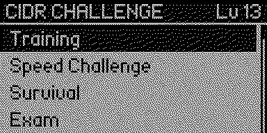
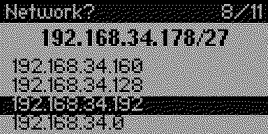
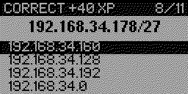
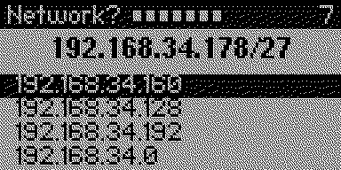
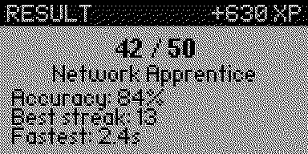
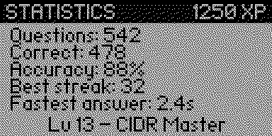

# CIDR Challenge

An IPv4 subnetting trainer for the Flipper Zero.

CIDR Challenge is **not** a subnet calculator. A calculator hands you the answer;
this app makes you find it. Every exercise is generated on the fly, the wrong
options are built from the mistakes people actually make, and the whole thing
runs offline on the device.

> 10 minutes a day to become faster at networking.




## Question types

| Question | Example | Answer |
| --- | --- | --- |
| Network address | `10.10.15.130/26` | `10.10.15.128` |
| Broadcast address | `172.16.20.64/28` | `172.16.20.79` |
| First usable host | `192.168.1.0/24` | `192.168.1.1` |
| Last usable host | `192.168.1.0/24` | `192.168.1.254` |
| Available hosts | `10.0.0.0/22` | `1022` |
| Mask to CIDR | `255.255.255.224` | `/27` |
| CIDR for a host count | `62 hosts needed` | `/26` |

Each exercise offers four choices. The three distractors come from classic
subnetting errors: forgetting the `-2`, using the neighbouring prefix, mixing up
the network and broadcast address, or snapping to the wrong block boundary.

## Game modes

**Training** — free practice, no pressure, run it as long as you like. Every
answer is scored right away and the correct option is highlighted, so a wrong
guess still teaches you something.



**Speed Challenge** — 60 seconds on the clock. Every correct answer adds to the
score, the timer never stops.

**Survival** — a single mistake ends the run. The header fills with streak pips
as you go.



**Exam** — certification-style simulation over 10, 25 or 50 questions with mixed
masks, closed by a scored report.



## Difficulty

| Level | Prefixes |
| --- | --- |
| Beginner | `/24` – `/26` |
| Intermediate | `/20` – `/30` |
| Advanced | `/8` – `/32`, including the `/31` and `/32` edge cases |

Advanced follows RFC 3021 for point-to-point links: a `/31` has **2** usable
addresses and a `/32` has **1**. Everything from `/8` to `/30` uses the classic
`2^n - 2` rule.

## Progression

| Reward | XP |
| --- | --- |
| Correct answer | +10 |
| Answered in under 5 s | +5 |
| Every 5 answers in a row | +25 |

100 XP per level, up to level 30.

| Level | Title |
| --- | --- |
| 1 | Subnet Beginner |
| 3 | Network Apprentice |
| 5 | Network Student |
| 8 | Subnet Engineer |
| 10 | CIDR Master |
| 15 | Packet Guru |
| 20 | Routing Wizard |



Lifetime statistics — questions, correct answers, accuracy, best streak and
fastest answer — are kept on the SD card. Hold **OK** on the Statistics screen to
wipe them.

## Controls

| Key | Action |
| --- | --- |
| Up / Down / Left / Right | Move between answers and menu entries |
| OK | Confirm, and continue after the feedback |
| Back | Leave the current screen, end the run |

## Storage

Everything is written to `/ext/apps_data/cidr_challenge/`:

- `stats.txt` — XP, questions, correct answers, best streak, fastest answer
- `settings.txt` — difficulty, exam length, sound

Both files are plain Flipper format text. If they are missing or damaged the app
starts from clean defaults, so deleting them is a valid reset.

## Install

Copy `dist/cidr_challenge.fap` to `/ext/apps/Games/` on the SD card, either over
qFlipper or by putting the card in a reader. The app shows up under **Apps →
Games → CIDR Challenge**.

## Build

The app is a standard external FAP with no dependencies beyond the SDK.

With the official firmware:

```
git clone https://github.com/flipperdevices/flipperzero-firmware.git
git clone https://github.com/AlastorApps/cidrchallengef0.git \
    flipperzero-firmware/applications_user/cidr_challenge
cd flipperzero-firmware
./fbt fap_cidr_challenge
```

The result lands in `build/f7-firmware-D/.extapps/cidr_challenge.fap`. Add
`COMPACT=1 DEBUG=0` for a release build, or use `./fbt launch APPSRC=cidr_challenge`
to build and run it straight on a connected Flipper.

With `ufbt`, from a clone of this repository:

```
ufbt
ufbt launch
```

## Layout

```
application.fam        app manifest
cidr_challenge.c/.h    app lifecycle, scenes, input handling
quiz.c/.h              exercise generation and distractors
subnet.c/.h            IPv4 subnet math
progress.c/.h          XP, levels, statistics, settings, storage
ui.c                   all screen drawing
icons/                 application icon
screenshots/           framebuffer captures used in this README
dist/                  prebuilt cidr_challenge.fap
```

## Compatibility

Tested on:

- Flipper Zero
- Official firmware
- Momentum firmware
- RogueMaster firmware

Requires:
- Internal storage only
- No external modules
- No internet connection
- No additional databases


## Contributing

Pull requests and suggestions are welcome.

Ideas, bug reports and feature requests can be opened through GitHub Issues.


## Who is this for?

- Network+ students
- CCNA candidates
- Cybersecurity students
- Pentesters
- Network administrators
- Anyone wanting to improve IPv4 subnetting speed


## License

GPL-3.0. See [LICENSE](LICENSE).

Created by Alastor — https://github.com/AlastorApps/cidrchallengef0
