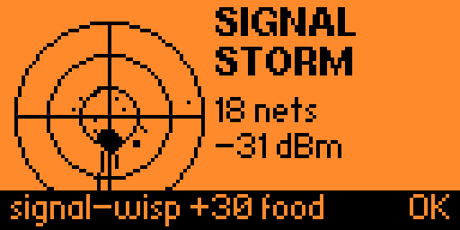

# Dragotchi

A dragon-raising virtual pet for the [Flipper Zero](https://flipperzero.one/)
that **senses the real world**. Raise an egg into a dragon — feed it, play with
it, keep it clean and healthy, discipline it, and let it sleep. **How well you
care for it decides who it becomes:** a radiant **white dragon** if you raise it
well, a **grey** dragon for middling care, or a **black dragon** if you neglect
it. Care for an adult impeccably and it can live *forever*.

Then take it hunting: the dragon **reads the real sub-GHz airwaves** for food,
treasure and eggs, and you can **send it on offline expeditions** for loot and a
journey log. Attach an ESP32 WiFi devboard and busy airwaves become a **signal
storm** that enriches your catches.



*The animated Signal Storm screen — shown when you hunt with the WiFi devboard
attached. The radar pings each nearby network; a dense area boosts your catch
and can drop an exclusive "storm egg."*

## Status

**v0.4.0** — built for Flipper Zero firmware **1.4.3** (API 87.1). Onboard
hardware only; the WiFi devboard is optional.

## Features

- **Care loop:** Hunger / Happiness / Health meters, plus poop, sickness, sleep
  (night 20:00–08:00) and discipline. Actions: Feed, Play, Clean, Medicine,
  Scold, Lights.
- **Care-driven evolution:** Egg → Hatchling → Wyrmling → Drake → Adult, and
  the adult (white / grey / black) is chosen by your care score. Care ≥ 90 makes
  an adult immortal (revocable); neglect kills. Offline simulation + an
  attention alarm when you reopen to a pet in trouble.
- **Hunt (real airwaves):** one-tap **Forage** sweeps 315 / 433 / 868 / 915 MHz,
  measures RSSI (receive-only, no transmit — region-safe), and busier
  surroundings yield better, rarer catches: prey (feeds it), treasure (builds a
  hoard → rank), or eggs (hatchery).
- **Expeditions:** send the dragon offline for Short 30 m / Long 2 h / Epic 8 h;
  needs pause while away; it returns with scaled loot and a journey log (longer
  trips risk coming back hurt, never fatal).
- **Inventory & Stats:** treasure by tier, hoard total & rank, eggs by rarity,
  lifetime catches, age/stage/care/discipline.
- **Legacy:** when a dragon dies, hatch an heir egg to continue with a care
  head-start (the hoard persists across the lineage).
- **Signal storm (optional):** with an ESP32-S2 WiFi devboard running the
  reporter firmware (`esp32/`), a hunt in a busy area opens an animated **radar
  screen** and gets a boost: better tiers, a guaranteed floor, WiFi-themed
  names, and an exclusive collectible **"storm egg"**. Plays identically with no
  board attached — it's pure enrichment. See `esp32/README.md`.

## Building & installing

Requires [`ufbt`](https://github.com/flipperdevices/flipperzero-ufbt) pinned to
the release SDK matching your firmware:

```sh
pip install ufbt
ufbt update --channel release      # must resolve to API 87.1 for fw 1.4.3
ufbt                               # builds dist/dragotchi.fap
ufbt launch                        # build + install + run on a connected Flipper
```

The compiled app installs to `/ext/apps/Games/dragotchi.fap`. For a full,
reproducible install (including the optional devboard) see **[RUNBOOK.md](RUNBOOK.md)**.

## Tests

Pure game logic is covered by a host test harness (no device needed):

```sh
make -C test/host run               # compiles the logic against a furi stub
```

## Repository layout

- `src/` — the FAP: data model, game logic, GUI (scenes/views), device seams
  (`hunt_hw.c` sub-GHz sensing, `esp_link.c` WiFi devboard link).
- `test/host/` — host test harness (seedable RNG, clock/HW stubs).
- `esp32/` — optional WiFi devboard firmware (MicroPython + reporter).
- `assets/` — 1-bit sprites; `tools/gen_art.py` regenerates them.
- `docs/superpowers/` — design specs and implementation plans.

## Credits & license

Dragotchi is a fork of **[MrModd's Matagotchi](https://github.com/MrModd/Matagotchi)**
and is released, like the original, under the **GPLv3**. All of MrModd's
original copyright and the `LICENSE` file are retained. Thank you to MrModd for
the excellent foundation (two-thread engine, offline state fast-forward, and
save system) that Dragotchi builds on.
