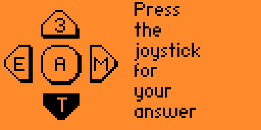

# Instant Character Recognition

Instant Character Recognition, or `ICR`, trains the awkward gap between _knowing_ Morse and hearing a character without translating it. The target is a direct sound-to-character reflex: hear the complete rhythm, recognise it, and react before a small committee in your head starts counting dits.

Open `Training → ICR`. The trainer uses a fixed pool of 40 characters: `A-Z`, `0-9`, `.`, `,`, `/`, and `?`. Every prompt is sent at 25 WPM. ICR is not tied to the current Koch lesson and has no speed control; the fixed speed is deliberate, because slowing a single character until it becomes countable would rather defeat the exercise.

## One Round

Each round separates recognition from answering:

1. The graph shows `Wait`, then the app sends one character and shows `Listen`.
2. When the sound has become a character in your head, press `OK`. The reaction timer stops on the press, so the later business of finding an answer does not make recognition look slower than it was.
3. Release `OK`. Five possible characters appear around the joystick. Press the direction containing your answer, or press `OK` for the centre choice.
4. The selected control depresses on screen. When you release it, the app records the answer, shows the correct character, then returns to the graph for the next round.

You have five seconds to recognise the prompt. A timeout counts as a miss. `Back` leaves the trainer; answers themselves always use the Flipper joystick, not the configured straight key or paddles.

In this example the five choices are `3`, `E`, `M`, `T`, and `A`. The lower `T` is black because `Down` is currently being held. Black means _pressed_, not necessarily correct; the verdict arrives when the control is released.

## Reading The Graph

The main screen is a compact map of all 40 characters. From left to right the bars are `A-Z`, `0-9`, `.`, `,`, `/`, and `?`. An untried character is a dot at the baseline. Once attempted, it becomes a bar: taller is faster, shorter needs work. The label in the top-right tells you whether the trainer is waiting, playing the prompt, or timing your reaction.

The two gaps across each tall enough bar mark useful boundaries. The upper band is roughly 600 ms or faster: recognition is becoming genuinely instant. The middle runs from roughly 600 ms to two seconds. Below that, the character was recognised slowly, missed, or confused with another one. A wrong answer or timeout is treated as the slowest result, because a very quick wrong answer is still wrong with impressive efficiency.

The height is a smoothed reaction average, not the result of only the last round. A good answer improves it; one mishap bends it rather than erasing the history. After each result, the bar for that character flashes before the next prompt begins, so you can see what changed without needing another statistics screen.

## How ICR Adapts

The prompts are not uniformly random. Unseen characters are asked often, slow characters gain weight, and fast familiar ones appear less frequently. The same character is not sent twice in succession. This keeps the exercise moving towards weak spots without turning it into a perfectly predictable punishment machine.

The five answer choices adapt too. The app starts with a table of plausible confusions, such as characters with related rhythms, then learns from actual mistakes. If you repeatedly hear one character and choose another, that wrong character becomes more likely to appear beside it in later rounds. Some random choices remain so the exercise can discover new confusions, and old confusion weights decay with practice rather than haunting you forever.

## Progress And Reset

ICR statistics persist between sessions. `Settings → ICR` contains only a confirmed statistics reset; there are no ordinary ICR settings to tune. Resetting clears the graph, reaction history, and learned confusions, so use it when you genuinely want a clean start rather than because one bar has offended you.

Use ICR after the characters are at least familiar. If you still need to reconstruct them from dits and dahs, return to [Listening Practice](200-koch-listening-practice.md) and learn the sounds first. Once individual characters are quick, [Callsign Listening Practice](230-callsign-listening-practice.md) is a better test of holding several of them in your head without the multiple-choice safety net.
