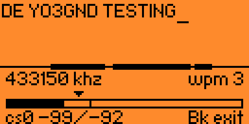

# Flipper as a Morse Transceiver

Morse Flipper can use the built-in Sub-GHz radio for small Morse experiments. It can send ordinary carrier-keyed CW, or a fixed 700 Hz tone over FM so compatible handhelds hear proper Morse audio. Treat it as a short practice link and radio bench, not as a field rig.

Open `Flipper Radio`. It has four entries:

- `Transmit`: send Morse on the selected frequency.
- `Receive monitor`: listen on the selected frequency and try to decode Morse timing.
- `Frequency`: choose the radio frequency, in kHz.
- [`ARDF Foxhunting`](302-ardf-foxhunting.md): run a clock-scheduled Morse beacon.

In real traffic, handover is part of the message. Send `BK` at the end when you are handing it back or inviting the other station in. [Here is how a standard contact in Morse usually happens](internal-help.md#a-complete-morse-contact).

## Frequency

The frequency editor uses six kHz digits. `433160` means `433.160 MHz`.

- `Left` / `Right`: choose the digit.
- `Up` / `Down`: change the digit.
- `Back`: accept the value and return.

The frequency screen tells you what the Flipper can do with that value:

- `TX allowed`: the radio can tune there, and the firmware allows transmit.
- `RX only`: the radio can tune there, but transmit is blocked by the firmware.
- `RX not available` / `PLL lock failed`: the CC1101 cannot lock there. The value is out of range and will not be saved.

If you open `Transmit` on an `RX only` frequency, the app shows the frequency and `TX Blocked`.

## Transmit

`Transmit` uses the normal keying setup from `Settings → Keying`.

- With `Input` set to `buttons` and a straight key mode, hold `OK` to send.
- With `Input` set to `buttons` and a paddle keyer such as `iambic b`, `OK` and `Back` act as paddles.
- With an external key or paddle, use the GPIO input you configured in settings.

If `Back` is acting as a paddle, long-press `Left` to leave the screen. A short press on `Left` clears the text buffer. Set speed, input, paddle swap, and keyer mode before entering `Transmit`; this screen is for sending, not for menu archaeology.

Short-press `Right` to toggle `CWFM off` or `CWFM on`. Off is the usual keyed carrier. On sends a fixed 700 Hz tone which an FM receiver can hear as Morse. The choice is temporary and returns to `off` when you reopen Transmit.

Sub-GHz keying and sidetone are driven from the same note state, so the beep you hear should track the carrier closely enough for this kind of experiment. It is still a Flipper transmitter: low power, small antenna, and no great claim to being a clean RF neighbour.

## Receive Monitor

`Receive monitor` listens on the current frequency and shows decoded text when the signal has decent Morse timing. It is useful for talking to another Flipper, an SDR, or even to a ham with a rig.

- `OK`: turn monitor audio on or off. This means the buzzer beeps when there is an incoming signal. It can be a real signal, and noise can trigger it too.
- `Left`: lower the signal threshold, making RX more sensitive.
- `Right`: raise the signal threshold, rejecting more noise and weaker signals.
- `Up` / `Down`: adjust the WPM hint.
- `Back`: leave the screen.

If decoding looks wrong, put the WPM hint near the sender's speed, then adjust the threshold so the signal crosses it cleanly and noise does not. The app can adapt after it has enough timing, but it needs something plausible to start with.

## FM Handhelds

With `CWFM off`, a stock Baofeng UV-5R, Quansheng UV-K5 or similar FM handheld cannot properly receive the Flipper's keyed carrier. Its receive light may blink, but that only proves it noticed RF; useful audio is another matter.

For actual Morse audio, tune both radios to the same supported frequency, open `Flipper Radio → Transmit`, and short-press `Right` until the screen says `CWFM on`. The handheld will hear a roughly 700 Hz tone for marks and silence between them. This has been tested on a UV-5R, a quansheng and a UV878.

With normal squelch enabled, the handheld may open its receiver during the carrier and play little or nothing. Squelch is the circuit that mutes speaker noise until the radio thinks a real signal is present. Disable squelch and the radio plays its background hiss all the time; when the Flipper transmits, the carrier can quiet that hiss, so the "Morse" becomes interruptions of noise by silence. Technically interesting, awful to copy.

You can also use an FM handheld as the transmitter for Flipper's `Receive monitor`. There is enough RF energy for the Flipper radio circuit to detect. Hold the handheld PTT or side button and key it by hand, but expect pain: many handhelds keep transmitting for roughly half a second after you lift your finger, partly because humans are fond of lifting that finger too early. In practice, that makes usable hand-keyed carrier tests about 2-3 WPM. The screenshot here is from my first RX test with a UV-5R because it was what I had on the bench. Notice how uneven the G is. That tiny test took about three minutes to key and roughly five attempts to get right, which is a useful warning label.

Some handhelds, especially Quansheng UV-K5-class radios with alternative firmware, can actually send a plain non-FM carrier. Better still, some of those firmwares can use a real paddle as input and their internal keyer, so the radio can send proper CW instead of PTT abuse with aspirations. Even when they advertise HF support, they are awful in the HF bands. On 2 m and 70 cm they are much more reasonable. In CW mode, they can also receive a keyed carrier from the Flipper.
