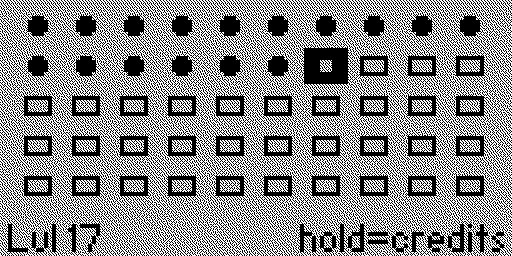
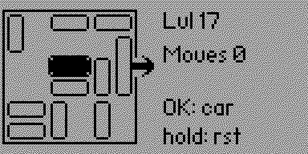

# Tutu

Sliding car puzzle ([Rush Hour](https://en.wikipedia.org/wiki/Rush_Hour_(puzzle))) for the [Flipper Zero](https://flipperzero.one/): 100 pre-generated levels with steadily increasing difficulty (optimal-solution length from ~2 up to ~24 moves), sequential unlock, and progress saved to the SD card.

## Features

- 100 pre-generated, solver-verified levels embedded in the app (no generation on the device).
- Difficulty curve that climbs steadily, with the hard ramp kicking in around level 75 (up to ~24 optimal moves).
- Cycle-and-slide controls: pick a car with OK, slide it along its lane with the D-pad.
- Sequential unlock; per-level completion and highest-unlocked progress saved to the SD card.
- Level-select grid showing locked / playable / completed states, plus a Credits screen.
- Fully offline — no network, no accounts.

## Screenshots

| Level select | Gameplay |
| --- | --- |
|  |  |

## Controls

**Game screen**

| Input | Action |
| --- | --- |
| **OK** | Select next car (cycles through cars in spatial order) |
| **Left / Right** | Slide the selected horizontal car along its lane |
| **Up / Down** | Slide the selected vertical car along its lane |
| **Hold OK** | Reset the current level |
| **Back** | Return to the level select |

Reach the exit on the right side of the board with the red car to win.

**Level select**

| Input | Action |
| --- | --- |
| D-pad | Move cursor |
| **OK** | Play an unlocked level |
| **Hold OK** | Open Credits |

## Build

Requires a local [flipperzero-firmware](https://github.com/flipperdevices/flipperzero-firmware) tree. Create a gitignored `local.mk` with your path:

```makefile
FLIPPER_FIRMWARE_PATH = /path/to/flipperzero-firmware
```

Then build the FAP:

```bash
make fap
```

Host tests, lint, and format:

```bash
make test
make linter
make format
```

Regenerate the embedded level bank header from `tools/levels.json`:

```bash
make levels
```

## License

[GPLv3](LICENSE)
