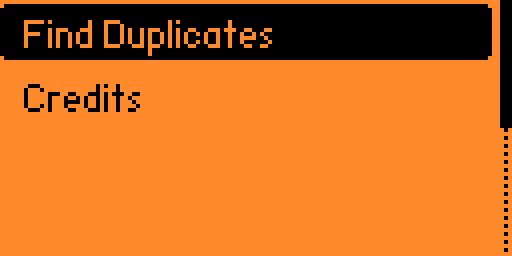
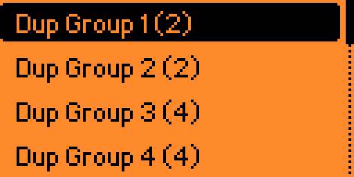
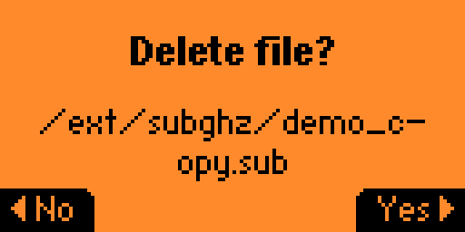

# Sub-GHz Duplicate Finder for Flipper Zero

An application for Flipper Zero to identify, manage, and clean up duplicate `*.sub` files from Sub-GHz storage.

## Screenshots

| Main Menu | Groups View | File Management |
| :---: | :---: | :---: |
|  |  |  |

> *Tip: Capture these screenshots using the "Remote" tab in qFlipper.*

## Development Setup

This project uses a standard `Makefile` for local development on your host machine (Linux/macOS).

### Requirements

- `gcc`, `make`, `clang-format`, `cppcheck`.

### Commands

- `make test`: Run unit tests for the core logic on your computer.
- `make format`: Automatically format code using `clang-format`.
- `make linter`: Run static analysis with `cppcheck` to ensure code safety.
- `make prepare`: Links your local project directory into the Flipper Zero firmware `applications_user` folder.
- `make fap`: Builds the `.fap` binary using `fbt` (requires firmware repo).
- `make clean`: Cleans local build artifacts.

## Building for Flipper Zero

1. Clone the official [Flipper Zero Firmware](https://github.com/flipperdevices/flipperzero-firmware).
2. Set the `FLIPPER_FIRMWARE_PATH` in your `Makefile` to point to your local firmware directory.
3. Run `make fap` from this project's directory. This command will:
   - Prepare the source code (symlink).
   - Clean previous builds.
   - Compile the binary using `fbt`.

## CI/CD

This project includes a GitHub Actions workflow that automatically runs:
1. **Linter** (static analysis).
2. **Format Check** (style enforcement).
3. **Unit Tests** (logic validation).

## Credits
Author: Endika
GitHub: [github.com/endika/flipper-sub-dup](https://github.com/endika/flipper-sub-dup)
