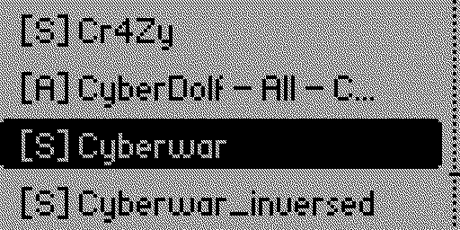
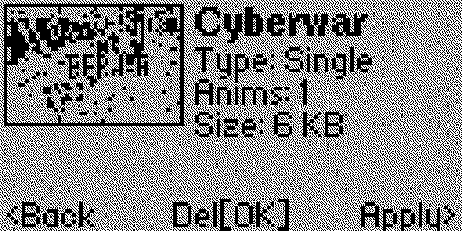
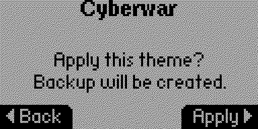
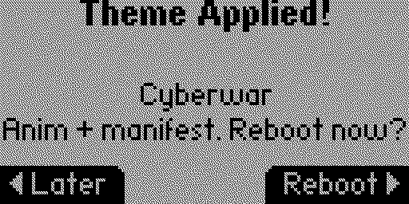
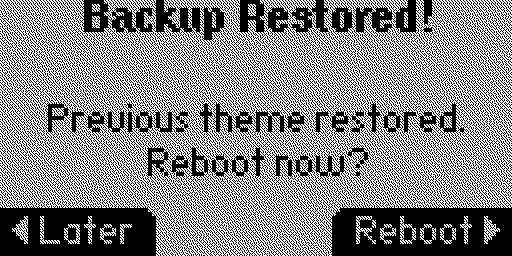
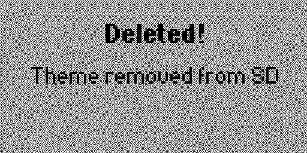
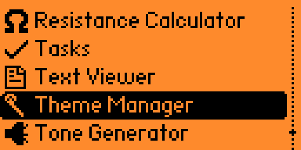

# 🎨 Theme Manager for Flipper Zero

[](https://github.com/Hoasker/flipper-theme-manager/actions)

Manage dolphin animation themes directly from your Flipper Zero — no PC required.

## Download

- [**Flipper Apps Catalog**](https://lab.flipper.net/apps/theme_manager) (coming soon)
- [**GitHub Releases**](https://github.com/Hoasker/flipper-theme-manager/releases)

## Screenshots

| Menu | Theme Info | Apply |
|:---:|:---:|:---:|
|  |  |  |

| Confirm | Reboot | Delete |
|:---:|:---:|:---:|
|  |  |  |



## Features

- **Scan SD card** — auto-detects animation packs in `/ext/animation_packs/`
- **3 theme formats** — Pack `[P]`, Anim Pack `[A]`, Single animation `[S]`
- **Animation preview** — thumbnail of first frame on the info screen
- **Theme info** — view type, animation count, and size before applying
- **One-tap apply** — merges theme files into `/ext/dolphin/`
- **Delete themes** — remove theme packs directly from the app
- **Auto-backup** — backs up entire `/ext/dolphin/` before overwriting
- **Restore** — revert to previous theme from the menu
- **Reboot dialog** — apply and reboot instantly, or keep browsing

## Installation

### From Releases (recommended)

1. Download `theme_manager.fap` from [Releases](https://github.com/Hoasker/flipper-theme-manager/releases)
2. Copy to your Flipper's SD card: `/ext/apps/Tools/`

### Build from source

```bash
cd theme_manager
ufbt
```

Copy `dist/theme_manager.fap` to SD card, or use `ufbt launch` to build & run.

## Adding Themes

Place theme folders in `/ext/animation_packs/` on your SD card:

### Format A — Pack (manifest + animation folders)
```
animation_packs/MyTheme/
├── manifest.txt
├── Anim1/
│   ├── meta.txt
│   └── frame_*.bm
└── Anim2/
    ├── meta.txt
    └── frame_*.bm
```

### Format B — Anim Pack (Anims/ subdirectory)
```
animation_packs/MyTheme/
└── Anims/
    ├── manifest.txt
    ├── Anim1/
    └── Anim2/
```

### Format C — Single Animation
```
animation_packs/MySingleAnim/
├── meta.txt
├── frame_0.bm
├── frame_1.bm
└── ...
```

## How It Works

1. Scans `/ext/animation_packs/` for supported theme formats
2. Select a theme → view info with animation preview
3. Apply → backs up `/ext/dolphin/` → merges new theme
4. Reboot to see new animations, or keep browsing
5. Use **Restore Previous** to revert anytime

## Custom Firmware

Override default paths at compile time:

```bash
ufbt CFLAGS='-DCUSTOM_ANIMATION_PACKS_PATH=EXT_PATH("my_anims")'
ufbt CFLAGS='-DCUSTOM_DOLPHIN_PATH=EXT_PATH("my_dolphin")'
```

## Requirements

- Flipper Zero with microSD card
- Works with official & custom firmware (Momentum, Unleashed, RogueMaster)

## Author

**Hoasker**

## License

[MIT](https://github.com/Hoasker/flipper-theme-manager/blob/main/LICENSE)
