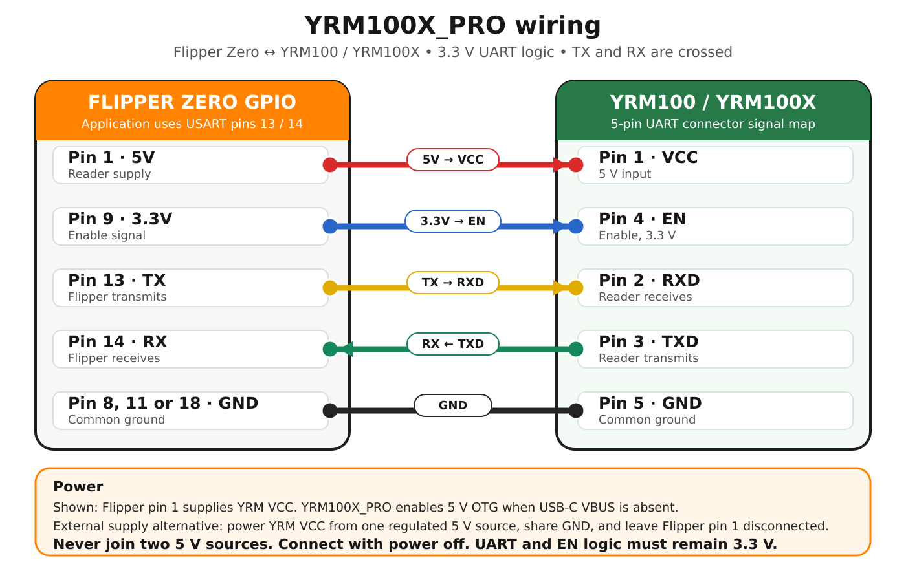
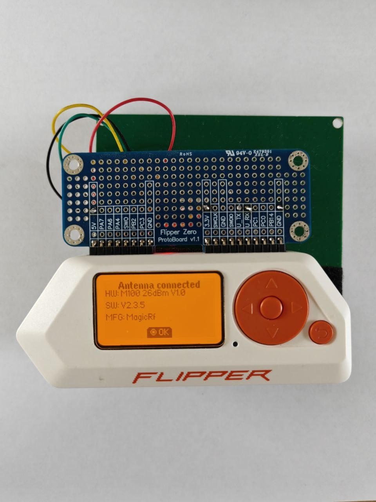
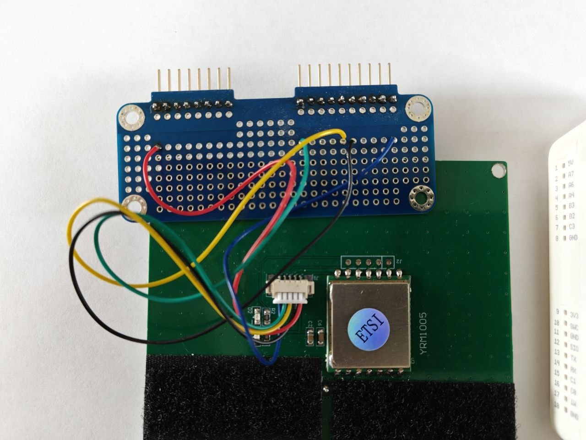
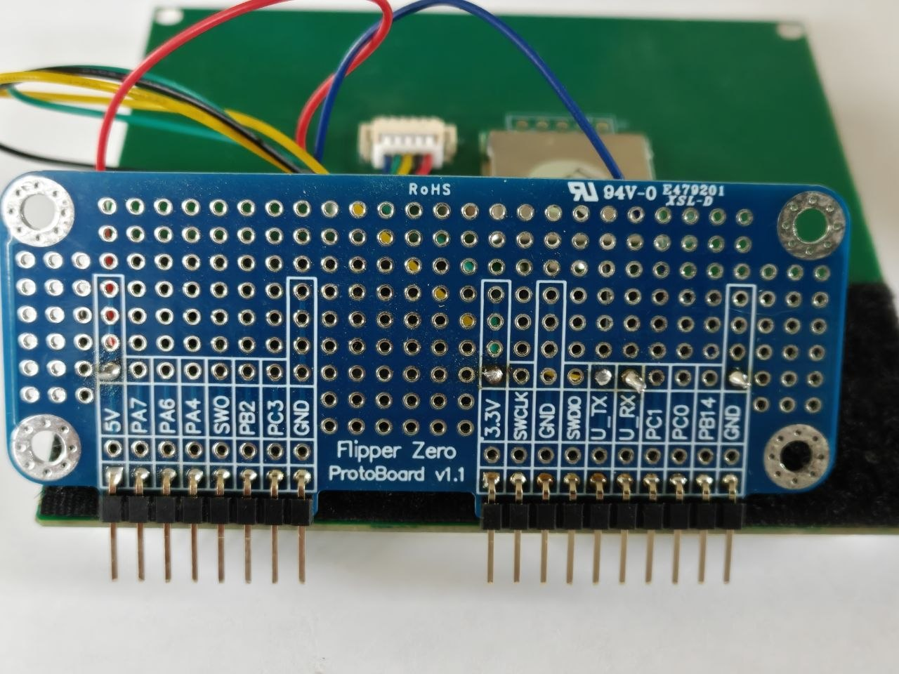

# YRM100X_PRO hardware connection

This page documents the tested five-wire connection between Flipper Zero and a
YRM100/YRM100X reader board. The photographs below show the working YRM1005
26 dBm setup used to test YRM100X_PRO version 1.7.

## Wiring diagram

The same diagram is also available as a scalable
[SVG source](images/yrm100x-flipper-wiring.svg).

| YRM connector | Signal | Flipper Zero | Typical wire in the photographed build |
| --- | --- | --- | --- |
| Pin 1 | VCC | Pin 1, 5V | Red |
| Pin 2 | RXD | Pin 13, USART TX | Yellow |
| Pin 3 | TXD | Pin 14, USART RX | Green |
| Pin 4 | EN | Pin 9, 3.3V | Blue |
| Pin 5 | GND | Pin 8, 11, or 18, GND | Black |

TX and RX must be crossed: Flipper TX goes to reader RXD, while reader TXD goes
to Flipper RX. EN is a 3.3 V enable input; it is not the reader's main power
connection.

YRM100X_PRO uses USART pins 13 and 14. The application manages Flipper's 5 V
OTG output: when USB-C VBUS is absent it requests OTG power, and when USB-C is
already present it does not enable the boost converter on top of VBUS.

Some reader boards or transmit-power settings may need more current than
Flipper Zero can provide reliably. For an external supply, connect one suitable
regulated supply to YRM VCC, connect its ground to both YRM and Flipper ground,
and leave Flipper pin 1 disconnected. Never connect two power-source positive
outputs together.

Connect or disconnect the reader only while power is off. Confirm the pin order
printed for the exact reader revision before applying power; cable colors are a
convenience, not an electrical standard.

## Complete assembled setup

The application has connected successfully and displays the reader hardware,
firmware, and manufacturer data.

## Reader and protoboard wiring

This view shows the five-wire reader connector, the YRM1005 module, antenna PCB,
and the underside of the Flipper protoboard.

## Flipper protoboard contacts

The soldered contacts used in this build are 5V, 3.3V, USART TX, USART RX, and
GND. The exact wiring table above is authoritative; always follow signal labels
rather than relying only on wire color.

## Reference

The five-pin YRM100 mapping is consistent with the community-maintained
[Flipper GPIO documentation](https://github.com/UberGuidoZ/Flipper/tree/main/GPIO)
and has been verified on the photographed hardware with YRM100X_PRO 1.7.
